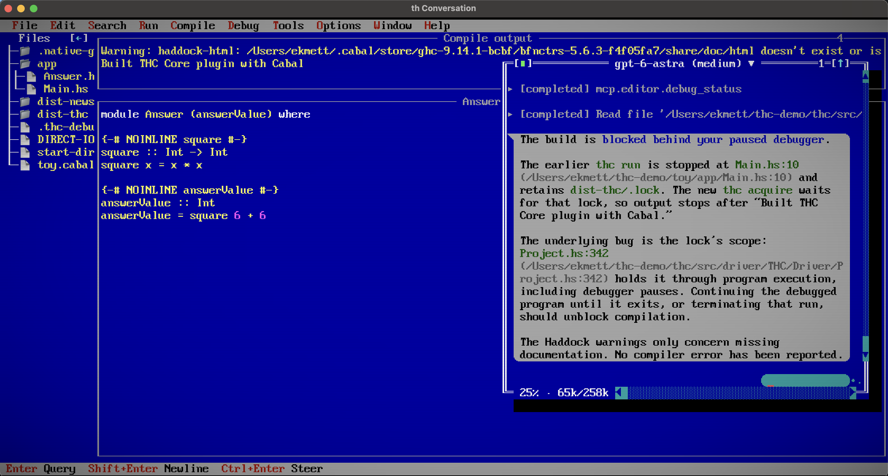

# hide — Haskell IDE


[](https://github.com/ekmett/hide/actions/workflows/docs.yml)
[](https://ekmett.github.io/hide/)

hide is a Haskell IDE written in Haskell. Edit source, inspect types and
diagnostics, build and debug programs, and work with agents. It runs in a
terminal, a native Metal/Vulkan window, or a browser, locally or over SSH.

It is also the Turbo Haskell editor, but does not require Turbo Haskell.
Use GHC and Haskell Language Server for ordinary Haskell projects, or THC
for projects running on Turbo Haskell.



[Documentation](https://ekmett.github.io/hide/) · [Installation](docs/install.md)

## Open a project

```sh
hide .
hide Main.hs Other.hs
```

Open a directory to browse its files and Cabal package, or name the files you
want to edit. The default display is a terminal. Use `--window` for a native
window or `--web` for a browser.

`make install` installs `hide`, the short command `th`, and a `thc-edit` launcher
beside it. With THC installed, `thc edit .` opens the same editor.

## Editing

Browse files and Cabal targets in the sidebar. Tile, cascade or split windows;
split views share a buffer and its undo history. Markdown files can be shown
as source or rendered text. PNG images open in an image window; other binary
files open in the hex editor.

Review edits as an inline or side-by-side diff, or show just the changed regions.
Unsaved files show line counts for additions and deletions. Saving checks for
changes on disk and offers a comparison when both versions have changed.
The Git view covers staged, unstaged and untracked files, with commit, fetch,
pull and merge commands.

Menus and the clickable status bar show the available actions and their keys.
The [editing guide](docs/editing.md) covers controls and default shortcuts;
[configuration](docs/configuration.md#keybindings) covers rebinding them.
See also [hex editing](docs/hex.md) and [Git](docs/git.md).

## Haskell

Haskell Language Server supplies types, definitions, completion, renaming and
diagnostics, including for unsaved code. Put an HLS compatible with the project's
GHC on `PATH`; hide starts it in the project.

Choose a toolchain and target to build or run. Interactive programs use an
embedded terminal. Launch a debugger or attach to a DAP server, set breakpoints,
step through code, and inspect the stack and variables.

The [Haskell guide](docs/haskell.md) covers language tools;
[running and debugging](docs/running.md) covers toolchains, terminals and debugger setup.

## Agents

Configure an ACP provider in **Options > Agents**, then open
**Tools > Conversation**. Choose the model and effort in the conversation title.
Ask about code, queue another query or steer a running reply. ACP and Copilot
can also provide inline completion suggestions.

Agents can read unsaved buffers, use HLS, run builds and tests, operate terminals
and debuggers, and make undoable edits through the editor's MCP tools. Configure
which operations are allowed, denied or require approval. Review proposed work
before allowing it, and expand tool calls to see their details.

See [conversations](docs/conversations.md) for setup and use,
[session tools](docs/session-tools.md) for permissions, and
[agent skills](docs/agent-skills.md) for workflows.

## Sessions and remote projects

Detach and return with `hide --resume`, or use `hide --web --resume` to continue
in a browser. **File > Exit** finishes the session.

With `hide` installed on both machines, open a remote project over SSH:

```sh
hide --window buildbox:projects/example
hide --web buildbox:projects/example
```

Files and tools stay on the remote machine. The display and clipboard stay
local. A dropped connection leaves the session running for you to reconnect.
See [sessions](docs/sessions.md) and [remote editing](docs/remote.md).

## Build and run

The default build includes native windows, the browser and embedded terminals,
along with terminal display and SSH sessions. You need GHC 9.6 or
newer, Cabal, `pkg-config`, utf8proc 2.10+, SDL3 3.4+ and libghostty-vt.
[Installation](docs/install.md) covers these dependencies and the Linux font stack.

```sh
cabal run hide -- --window .
cabal run hide -- --web .
cabal install exe:hide --installdir="$HOME/.local/bin"
```

`--window` selects Metal on macOS and Vulkan elsewhere. Build flags are opt-out:
`-f-window`, `-f-web` and `-f-terminal` omit individual components. A minimal
terminal-display or remote-server build is:

```sh
cabal install exe:hide -f-window -f-web -f-terminal
```

It needs utf8proc but neither SDL nor Ghostty. Sessions and SSH editing remain
available in every build.

## Development

[Contributing](docs/contributing.md) covers builds, checks and source layout.
[Architecture](docs/architecture.md) describes buffers and rendering;
[design documents](docs/design/) record work in progress.

[THC](https://github.com/ekmett/thc) is the separate compiler and runtime.

## Contact Information

Contributions and bug reports are welcome. Please contact me through GitHub.

-Edward Kmett
