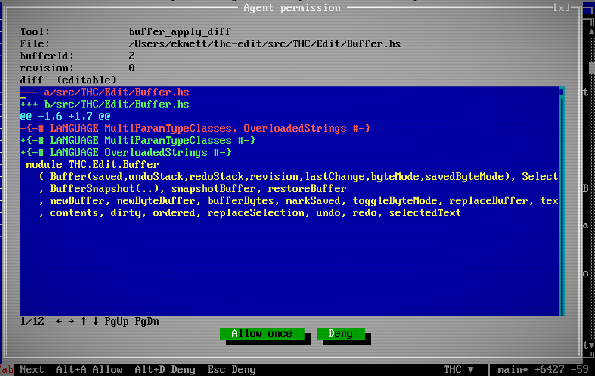

# Agent operation reference

Compact reference for the editor MCP server. Start with the
[skills catalog](agent-skills.md) for task workflows or [session tools](session-tools.md)
for the user guide. `tools/list` is authoritative for the running version’s
schemas; fields below omit JSON type boilerplate.

**Notation:** `?` marks an optional argument; `{}` means no arguments. **R** is
read-only, **W** changes editor/files/settings, **X** can execute/control programs,
**Q** asks the user. These are descriptive categories: actual policy is selected
per tool in **Options > Agent Permissions**. Read-only tools default to Enable;
other tools default to Prompt. `editor_settings` can write, so even its read form
uses that tool’s policy.

## Protected content policy

One policy classifies editor authority and protected UI content. It applies to
agent-facing reads and actions regardless of the human's Streamer setting. Turning
Streamer mode off does not grant an agent access. The path predicate lives in
`Hide.Privacy`; resource and UI projections consume it through `Hide.GuestAccess`
and the model. Path resolution belongs to service workers, not rendering.

**Authority paths** are the host-registered canonical global/project configuration
files, editor session/recovery store, agent configuration/resume records and live
session endpoint directory, including descendants of registered roots. Any file
whose basename is `thc.toml` (case-insensitive) is also authority. Component-wise
containment excludes similarly prefixed siblings; known symlink paths must be
resolved before admission. This is one host-maintained set, not a per-tool choice.

**Protected UI content** includes human conversation/question drafts, pending
approval controls, provider/session credentials and sensitive configuration values.
Agents may inspect nonsensitive settings but cannot change their own permissions,
submit a human's answer, or type into a human composer. Generic reads of approval
and Git-review buffers are refused; structured Git tools provide separately checked
results. Public conversation transcripts are distinct from their protected spans.
Plugin windows remain private until the host accepts explicit semantic access.

Structured records whose owning source is an authority path are omitted as records,
including their path and diagnostic body. Screens preserve geometry with masked
cells and safe titles. Filter before pagination and serialization; delayed workers
must recheck the current policy before publishing or applying their result. Apply
the rule to provenance rather than scanning unrelated source text for strings that
look like secrets. Per-surface sections below describe output shape and additional
operation constraints, not alternative definitions of authority.

This is an editor boundary, not a secret scanner or an OS sandbox. Approved
terminal/build programs, language servers, debugger evaluation and trusted native
plugins execute with their process account's access. Their arbitrary output cannot
be made confidential merely by recognizing protected editor paths. Documentation
reads use a bounded declared corpus, not automatic classification of every word.

## Buffers, files and search

| Tool | Kind | Arguments | Result / contract |
| --- | --- | --- | --- |
| `list_buffers` | R | `{}` | Buffer IDs, paths, revisions, dirty state; includes untitled buffers |
| `list_windows` | R | `{}` | Window IDs, titles, buffer IDs, rectangles, active window and panels |
| `read_buffer` | R | `bufferId?`, `startLine?`, `lineCount?`, `byteOffset?` | Live text; 200 lines default, 1000 maximum. Binary: up to 4096 hex bytes. Defaults to active buffer |
| `read_selection` | R | `windowId?` | Selected content and cursor offsets; `coordinateSpace` is `source` or `rendered-markdown`. Defaults to active window |
| `workspace_project` | R | `{}` | Project root, Cabal package file, active source, unsaved buffers, existing Cabal component/dependency graph |
| `workspace_search` | R | `query`, `trackedOnly?`, `offset?`, `limit?` | Literal line matches with live-buffer substitution; tracked-only or ignore-respecting workspace search |
| `editor_file` | W | `action`, `bufferId?`, `windowId?`, `path?`, `revision?`, `dirtyAction?` | `open`, `save`, `close`; save/close require current revision. Dirty close requires `save` or `discard` |
| `buffer_apply_diff` | W | `bufferId`, `revision`, `diff` | Strict unified diff, atomic and undoable, no save; returns new revision |
| `workspace_files` | W | `operation`, `path`, `to?` | `mkdir`, `create_file` (empty), `delete`, `rename`; only rename takes `to` |

Search: `query` is 1–256 characters on one line; `offset` 0–9999; `limit` 1–1000
(default 100). Skips binary/files over 1 MiB; caps the scan at 32 MiB and 10,000
files/matches. Inspect truncation flags. Filesystem mutations stay inside the
project, refuse overwrite/dirty descendants, protect Git metadata and symlink
endpoints, and do not recursively delete directories. Save uses disk-conflict
checks. These reads use the [protected content policy](#protected-content-policy).

`workspace_project.cabalPlan` reads only `dist-newstyle/cache/plan.json`; it does
not invoke Cabal. `status` distinguishes `available`, `missing`, `invalid`,
`too-large`, and `unavailable`. Available results include compiler/Cabal versions,
plan modification time and age, package unit IDs/names/versions/type/style,
local component references, and Cabal's `depends`/`exeDepends` edges. Nested
Custom Setup components retain their separate dependencies. Package source roots are
workspace-relative; external/protected paths, repository URLs, flags and compiler
arguments are omitted.

`freshness.status` is `stale` when known manifests are newer or have unsaved
edits, otherwise `unknown`: timestamps do not establish that a plan matches the
current source or configuration. Check `dependenciesKnown`, `graphComplete`,
`omittedUnits` and `truncatedUnits` before treating the result as complete. Reads
stop at 8 MiB and inspect at most 4096 units; graph output is capped at 512 KiB
and the full response at 1 MiB. Truncation removes whole units, retaining every
reported unit's emitted dependency edges, which may refer to omitted units.

## History

| Tool | Kind | Arguments | Result / contract |
| --- | --- | --- | --- |
| `editor_history` | R | `bufferId`, `direction?`, `offset?`, `limit?` | Diff previews, newest first, for steps that would be applied; no mutation |
| `editor_undo` | W | `bufferId`, `revision`, `direction?`, `steps?` | Apply undo/redo atomically; no save; returns revision and remaining counts |

`direction` is `undo` (default) or `redo`. Preview offset 0–100, limit 1–10
(default 5); apply 1–100 steps (default 1). Insufficient history/stale revision
fails without edits. Binary previews describe byte changes.

## Haskell language service and Messages

| Tool | Kind | Arguments | Result / contract |
| --- | --- | --- | --- |
| `workspace_diagnostics` | R | `offset?`, `limit?` | HLS/build/Messages snapshot with positions and reported/current revisions |
| `lsp_hover` | R | `bufferId`, `line`, `column`, `revision?` | Hover text and type information |
| `lsp_definition` | R | `bufferId`, `line`, `column`, `revision?` | Definition locations |
| `lsp_type_definition` | R | `bufferId`, `line`, `column`, `revision?` | Type definition locations |
| `lsp_references` | R | `bufferId`, `line`, `column`, `revision?`, `includeDeclaration?` | Reference locations; declarations included by default |
| `lsp_document_symbols` | R | `bufferId`, `revision?` | Document symbol structure |
| `lsp_rename` | W | `bufferId`, `revision`, `line`, `column`, `newName` | Apply HLS rename to live buffers; reject stale source; no save |
| `lsp_code_actions` | R | `bufferId`, `revision`, `line`, `column`, `endLine?`, `endColumn?` | List up to 128 action IDs with title/kind/preference and disabled reason; includes current intersecting diagnostics |
| `lsp_apply_code_action` | W | `bufferId`, `revision`, `actionId` | Consume a listed action once; apply checked edits and advertised HLS commands; report partial command results |

Calls synchronize unsaved Haskell text. Editor input positions use 1-based
Unicode code points; raw LSP results use 0-based UTF-16. Responses identify the
source revision. Diagnostic messages are capped at 8192 characters. Code-action
ranges default to the cursor; supply both end coordinates for a selection.
A new action list expires previous IDs. Application requires the original source
revision and unchanged affected files, excludes protected files and other
projects, and never accepts caller-supplied edits or commands. Commands must be
returned by the chosen action and advertised by that HLS process. A literal edit
is applied before its command. HLS text edits affect buffers without saving;
commands themselves can have server-side effects, such as evaluating doctests.
File creation/deletion operations and unsolicited edits are refused.

Each command result includes `succeeded`, `commandSucceeded`, `applied`,
`appliedBatches`, `partial`, `error`, and changed buffer revisions. A successful
command response does not override a rejected edit. Each accepted edit batch is
atomic; the whole command is not. Earlier accepted edits remain if a later batch,
the command, or the waiting client fails. Completed commands, including error
responses, reuse the initialized HLS process. Cancellation sends `$/cancelRequest`
and rejects further edits while retaining the command slot until the terminal
response. Only a broken transport or cancellation that has not settled within
two seconds restarts HLS and invalidates its action IDs. At most one command runs
per project client, with at most 128 accepted edit batches and a 30-second request
deadline. LSP does not attach an originating command ID to `workspace/applyEdit`:
the editor admits edits during the serialized command interval and checks their
paths and revisions; this is not isolation from a malicious language server.
`appliedBatches` counts accepted batches, including empty or no-op batches;
`buffers` lists only changed buffer revisions.

## Build, test and execution

| Tool | Kind | Arguments | Result / contract |
| --- | --- | --- | --- |
| `build_status` | R | `{}` | Active job/last completion, exact job ID, semantic window ID when open, retained character count/truncation, actual exit code |
| `build_output` | R | `jobId`, `offset?`, `limit?` | Combined command echoes/stdout/stderr for that job; offsets count Unicode characters in the retained tail; default/maximum 32768 characters |
| `build_start` | X | `action`, `toolchain?`, `target?`, `arguments?`, `terminal?` | `compile`, `make`, `run`; `THC` or `GHC`; overrides apply to this job |
| `build_stop` | X | `{}` | Stop captured build/run; keep output and completion status |
| `test_start` | X | `target?`, `toolchain?` | Cabal test job; supported toolchain `GHC` |
| `test_status` | R | `{}` | Cabal suite outcomes, explicit TAP 13 test points, process status and compiler diagnostics |
| `terminal_list` | R | `{}` | Shared Ghostty terminal IDs, buffer IDs and exit codes |
| `terminal_start` | X | `command`, `args?`, `cwd?`, `outputByteLimit?` | Executable plus argument array; no implicit shell; opens window and returns terminal ID |
| `terminal_output` | R | `terminalId`, `offset?`, `limit?` | Retained output and exit code; at most 128 KiB per call |
| `terminal_input` | X | `terminalId`, `text` | UTF-8 input, including control characters |
| `terminal_stop` | X | `terminalId` | Terminate process; keep output window |

Builds require saved source buffers. Build/tests share one job slot. Read build
output through `build_output` using the exact `jobId` from `build_status`.
The last job remains readable after completion or window closure; starting a new
job expires its ID. An already admitted read returns its captured snapshot with
the original job ID. The owner reuses its read-only text view geometry with a fresh content lifetime
for a new job, without a source buffer ID. Checkpoints retain the output as an
inert ended view, without restarting a process or restoring a live job ID. Closing it does not stop the process or let late
output reopen it. Terminal output offsets refer to the retained tail;
`truncated` reports discarded earlier output. Execution runs with the editor
account’s access. Captured job output is readable under its own tool permission;
it is not scanned for secrets. This grants no access to other plugin windows. UI
privacy masks are not an OS execution sandbox.

`test_status` recognizes [TAP 13](https://testanything.org/tap-version-13-specification.html)
on stdout beginning with `TAP version 13`. It reports top-level test numbers,
names, pass/fail, skip reasons, TODOs, and unexpected TODO successes. Each stream
reports its planned and observed counts and whether it is complete, incomplete,
invalid, or bailed out. Nested subtests and YAML diagnostics remain in captured output. Stderr never supplies test points. At most 500 cases and streams are
returned, with truncation flags; failures beyond the case limit still fail the
run. Missing/truncated output cannot establish completeness, and process failure
always wins. Other runners retain suite-level results without guessed cases.

## Debugging

| Tool | Kind | Arguments | Result / contract |
| --- | --- | --- | --- |
| `debug_status` | R | `{}` | Adapter readiness, stopped state, generation, selected frame, follow mode, capabilities, breakpoints, recent output, `terminated`, `finishing`, nullable `exitCode` |
| `debug_present` | W | `follow?`, `view?`, `generation?` | Set automatic UI following; reveal `source`, `stack`, `scopes` or `output` from the shared session |
| `debug_launch` | X | `adapterConfig?`, `port?` | Configured THC target or general DAP JSON config; refuses an already active session |
| `debug_attach` | X | `host?`, `port?` | Loopback adapter; defaults to `127.0.0.1:4711` |
| `debug_control` | X | `generation`, `command` | `continue`, `next`, `stepIn`, `stepOut`, `pause`, `disconnect`; acceptance is not a stop |
| `debug_set_breakpoints` | W | `generation`, `bufferId`, `lines` | Replace that buffer’s source breakpoint set; pending/verified state, `sourceModified` |
| `debug_inspect` | R | `generation`, `request`, `threadId?`, `frameId?`, `variablesReference?`, `sourceReference?`, `start?`, `count?` | `threads`, `stackTrace`, `scopes`, `variables`, `source`; handles depend on request |

`follow: false` keeps automatic stops in the background. `follow: true` follows
future stops. An explicit `view` requires current `generation`; source/stack/scopes
require a stopped, configured session. Reveal a view without changing follow
mode by omitting `follow`. This does not launch or resume a separate debugger.

Refresh generation after execution changes. Stack/variable inspection requires
a stopped target. Inspection pages default to 100 entries, maximum 1000.
Breakpoints use 1-based lines, at most 1000. See the
[debugging skill](agent-skills.md#debug-a-program), also published as
`hide://debugging` through MCP resources.

## Git

| Tool | Kind | Arguments | Result / contract |
| --- | --- | --- | --- |
| `workspace_git` | R | `view`, `path?` | `status` or `diff`; disk changes and unsaved buffers reported separately |
| `git_fetch` | W | — | Fetch the selected repository’s configured default remote; returns `accepted` and `jobId` |
| `git_pull` | W | — | Fetch configured upstream, check incoming changes, then fast-forward only |
| `git_merge` | W | `ref` | Merge a named local or remote-tracking branch with checked incoming paths |
| `git_review` | R | — | Start a complete saved-change review; poll for `diff`, `complete`, and a one-time `reviewId` |
| `git_commit` | W | `reviewId`, `message` | Commit all reviewed saved changes using ordinary Git staging and hooks |
| `git_operation_status` | R | `jobId?` | `busy`, job state/exit code, complete review, or commit `head` and `reviewedTreeMatched` |

Diff text is capped at 128 Ki characters. A path filter is a literal file path,
not a Git glob/magic pathspec. Whole-repository diffs apply the [protected content policy](#protected-content-policy), including Git-detected rename/copy
destinations derived from them; `omittedFiles` reports a count without their names. Agent mouse/key input cannot
open the unrestricted human Git review or commit dialog; use `workspace_git`
for filtered review. `workspace_search` with
`trackedOnly: true` searches tracked source. Commit-history search is not exposed as an agent tool.

Each Git tool has its own permission policy. Fetch
shares the human Git operation slot, permits unsaved editor changes, and does not
change working files. It accepts no remote URL, refspec, shell, or configuration
overrides. Acceptance does not imply success: poll status for completion. The
latest 16 agent jobs remain queryable for this session; omit `jobId` for the latest.
`busy` also includes human Git operations. A launch failure has `state: "failed"`
and a null exit code; a process exit reports its actual code. Transport output,
URLs, and raw errors are not returned or placed in agent fetch output buffers.
Normal Quit waits for the active operation; session teardown cancels and reaps
the active Git process.

`git_pull` and `git_merge` use the same job slot. Both require saved editor
buffers and a clean index/worktree, and refuse unfinished Git operations or
hidden/sparse index entries. Pull fetches the configured default remote, then
checks the configured upstream and performs an explicit fast-forward-only merge;
it does not rebase or honor an automatic stash setting. Merge accepts a local
or remote-tracking branch name (or its full `refs/heads/` / `refs/remotes/` name),
not arbitrary revisions, URLs, refspecs, or options. Ambiguous and symbolic names
are refused. Both pin the target commit and recheck the selected repository,
HEAD, and authority policy before mutation. Typing while fetching prevents the
merge; typing while Git runs preserves the unsaved buffer during reload.

Incoming protected paths, their ancestors, Git-detected private rename/copy
sources, and changed symbolic links or submodules are refused. Unchanged tracked
private configuration does not block safe changes. Protected differences between
current HEAD and the target are also refused, even if a particular merge would
leave them untouched; this prevents HEAD-side renames from redirecting incoming
edits into private files. Agent merges disable Git's directory-rename propagation.
Ignored local files are not overwritten. Normal configured Git hooks and merge drivers still execute; the
path checks do not sandbox those programs. Status includes `phase`, `head`,
`fetchExitCode` (pull only), and `conflicts` (count, or null if inspection failed).
The ordinary `exitCode` is the merge exit, a failed fetch's exit, or null when
preflight/launch prevented execution. A failed merge can leave conflict files
and merge state; no automatic reset or abort discards them. A successful fetch
remains effective even when the following merge is refused. No tool pushes.

`git_review` and `git_commit` also return acceptance and a job ID first. A review
is a composite read operation: its successful `exitCode: 0` denotes a completed
review, not a single subprocess exit. Fetch and commit report actual process
exit codes. A review
covers staged, unstaged and untracked **saved** changes, with the same binary
notices and content hashes as the human Git review. There is no partial commit
or separate staging requirement. Both tools refuse dirty editor buffers. A
review is refused if private changes (including Git-detected rename/copy
lineage) would be omitted, its text exceeds 128 Ki characters, its private
snapshot exceeds 1 MiB, or classification exceeds 10,000 files. An unchanged
tracked private configuration does not block a safe review. No truncated or
omitted review receives a committable ID; a clean repository has no commit ID.

Only the most recent complete review ID is valid. A commit attempt consumes it,
rechecks the current privacy policy, and refuses changed HEAD, index or file
contents. Raw snapshots remain server-side. Commit uses the existing whole-repo
`git add -A` and normal Git hooks. Failure can leave reviewed changes staged;
files are not rolled back. Ordinary hooks can alter files or the committed tree:
`reviewedTreeMatched: false` reports a mismatch, and `null` means no successful
comparison. `head` reports the observed resulting commit when available, including
after a failed commit. A successful exit is retained even if that follow-up
inspection fails. Hook output and raw errors are suppressed.

## Windows, panels and binary navigation

| Tool | Kind | Arguments | Result / contract |
| --- | --- | --- | --- |
| `editor_layout` | R | `{}` | Character-cell resolution, window rectangles, modes, cursors and docks |
| `editor_navigate` | W | `windowId?`, `bufferId?`, `path?`, `line?`, `column?`, `byteOffset?` | Focus/open and navigate; no save; byte offsets require hex mode |
| `editor_arrange` | W | `action`, `windowId?`, `x?`, `y?`, `width?`, `height?` | `tile`, `cascade`, `split_vertical`, `split_horizontal`, `focus`, `move`, `resize`, `zoom`, `pin`, `unpin` |
| `editor_panels` | W | `files?`, `messages?`, `filesWidth?`, `messagesHeight?` | Set visibility/dock dimensions; panel must be visible to resize |
| `editor_mode` | W | `mode`, `windowId?`, `bufferId?` | `text` or `hex`; preserve bytes; refuse invalid UTF-8/NUL in text mode |

Coordinates are 0-based character cells, text locations 1-based, byte offsets
0-based. Geometry obeys screen limits and docking; use returned rectangles.
Files width is at least 16 cells; Messages height at least 3, within available
screen space. Split windows share their buffer and undo history.

`pin` and `unpin` apply to terminal windows. Pinned terminals and Messages share
one bottom panel; `messagesHeight` resizes it even when the Messages tab is
hidden. `editor_layout` reports each window's `pinned`, `visible` and `focused`
state and the panel's `selectedWindowId` (null for Messages). Focusing a hidden
terminal selects its tab. Unpin before moving, resizing, zooming or splitting
that window; tile/cascade leave pinned terminals in place. These operations
preserve the running terminal and its IDs.


## Screen and input

| Tool | Kind | Arguments | Result / contract |
| --- | --- | --- | --- |
| `editor_screen` | R | `image?` | Colorless text grid, optional PNG, readable/clickable cell masks, command/key permissions |
| `editor_input` | W/X | `events` | 1–64 sequential input events; returns applied count, exit flag, error, text copied by the agent and settings |
| `clipboard_write` | W | `text` | Write supplied text and queue frontend copy; never read existing clipboard |

Input event forms:

```json
{"type":"key","key":"F3","mods":[]}
{"type":"paste","text":"supplied text"}
{"type":"mouse","action":"down","x":10,"y":5,"button":0,"clicks":1,"mods":[]}
{"type":"mouse","action":"up","x":10,"y":5,"button":0}
{"type":"modifiers","mods":["ctrl"]}
{"type":"blur"}
```

Mouse actions: `down`, `up`, `move`, `wheel-up`, `wheel-down`; button 0 left,
2 right. Modifiers: `ctrl`, `alt`, `shift`. Keys: characters, `Enter`, `Escape`,
`Tab`, `ArrowUp/Down/Left/Right`, `Home`, `End`, `PageUp`, `PageDown`, `Backspace`,
`Delete`, `Insert`, `F1`–`F24`. Paste is capped at 64 Ki characters per event.
Input is not transactional: inspect partial results before retrying.

The host identifies input from an agent. Each batch starts without human clipboard,
drag or key-prefix state; gestures may span events within the batch. Agent input
cannot submit chat as the person, answer its own questions/approvals, modify agent
settings/permissions or toggle Streamer mode. Generic reads and screen captures
also protect drafts, authority files and session keys.

Screen capture is capped at 32,768 cells; PNG at 4 megapixels/2 MiB. PNG uses the
bundled bitmap font, excluding OS chrome, CRT and native Unicode shaping.
Clipboard text is capped at 1 MiB UTF-8 with no NUL; frontend permission can
prevent OS export even after queueing succeeds.

## Agent sessions and coordination

The primary conversation receives these tools through its authenticated `editor`
server. Children receive an `editor` server for their own workspace and an
`agents` server for coordination. Caller identity is assigned by the host; tool
arguments cannot select another sender or redirect editor calls to another
workspace.

| Tool | Kind | Arguments | Result / contract |
| --- | --- | --- | --- |
| `agent_directory` | R | `{}` | Named agents, stable IDs, parents, state, workspace, limits and advertised model/effort choices |
| `agent_spawn` | X | `name`, `task`, `context?`, `sourceAgentId?`, `model?`, `effort?`, `workspace?` | Create child, queue its task, return metadata and message ticket; no display focus change |
| `agent_rename` | W | `agentId`, `name` | Rename self or another agent; stable ID and rename attribution remain |
| `agent_message` | X | `agentId`, `text` | Queue attributed message; return ticket |
| `agent_wait` | R | `agentId`, `ticket`, `timeoutMs?` | Wait 0–60,000 ms, default 30,000; timeout reports running without cancelling |
| `agent_cancel` | X | `agentId` | Cancel current/queued messages; human or ancestor only; keep session |
| `agent_end` | X | `agentId` | End session and descendants; human or ancestor only; retain history and worktrees |
| `agent_history` | R | `agentId`, `after?`, `limit?` | Retained events; `nextAfter` continues, `dropped` counts discarded older events |
| `agent_search` | R | `agentId`, `query`, `after?`, `limit?` | Literal, case-insensitive search of retained events |

Names are unique ignoring case, at most 80 characters without controls. Tasks
and messages accept at most 65,536 characters. History pages default to 50
entries, maximum 100; search queries accept at most 4096 characters. Agent IDs
remain stable when names change. A parent occupies its child's user seat;
messages from other agents remain peer messages, not human instructions.

`context` defaults to `fresh`. `fork` requires `sourceAgentId`, caller ownership
and actual provider fork support; it never silently starts a fresh conversation.
Choose `model` and `effort` only from provider-advertised choices.

`workspace` defaults to `{"mode":"worktree"}`: a separate checkout of the caller's
committed `HEAD`, detached unless a `branch` is specified. Optional `ref`, `branch`
and `name` retain their normal worktree meanings. Unsaved/uncommitted parent edits
are not copied. Git is required; failure never falls back to shared mode. Its
editor runs without a display until opened, with separate buffers, build jobs,
terminals and debugger. Explicit `{"mode":"shared"}` opts into the parent's editor
and existing job slots. The human New Agent dialog creates a shared child.
Ending an agent does not delete its worktree.

Global `[editor.agents]` sets `max_agents` (default 8, range 1–64, including the
primary) and `max_subagents` (default 4, range 0–64 direct children per agent).
Project `thc.toml` may lower these ceilings; agents cannot raise them. Both limits
are checked at spawn. See [configuration](configuration.md#agent-limits).

**Tools > Agents** or **Window > Agents** opens the directory. Conversation shows
live child messages, retained tool details and a protected human composer.
Human messages to parent-controlled children retain peer attribution. Drafts,
transcripts and view positions survive switching and editor recovery. Workspace
opens the associated editor; Reconnect explicitly loads a recovered provider
without replaying queued work. The human can change an idle child's advertised
model/effort through its title menu and steer a reply when supported. Context
usage is shown only when supplied by that child. These controls do not add a
writable agent-settings MCP tool.
`agent_settings` reports Primary's configuration and labels that scope, even
when a child conversation is selected.

## Conversation and settings

| Tool | Kind | Arguments | Result / contract |
| --- | --- | --- | --- |
| `ask_user` | Q | `question`, `choices?`, `allowMultiple?` **or** `questionId` alone | Create an inline question and return pending immediately; retrieve its owned pending/answered/cancelled result |
| `agent_settings` | R | `{}` | Public provider/model/config choices, connection/steering state, context usage and global/project guidance |
| `environment_get` | R | `names?` | Effective subprocess environment; credentials/authority values redacted; missing names null |
| `environment_set` | X | `values`, `scope?` | String sets, null unsets; session/project/global; affects new processes; project overrides global; protected variables denied |
| `editor_settings` | W | `settings?`, `defaults?` | Read current state, change session settings or merge future startup defaults |

Questions: 1–4096 characters; up to 12 choices of 1–256 characters;
`allowMultiple` must be false. One pending question. Creating it follows the
configured permission policy, then returns `questionId` and `status: "pending"`.
Retrieving that ID requires the same authenticated caller/provider incarnation;
it does not prompt again, but current Disable policy still applies. Pending
results reveal neither the draft nor the current choice. Answers require explicit
human submission and are limited to 65536 characters.

The submitted answer is queued once to the original live Primary Conversation
provider through its normal query queue. Authenticated calls made without a live
provider are poll-only. Anonymous calls, including current worktree-child editor
bridges without attributed credentials, are refused. Replacement or disconnection
invalidates delivery to that provider. Up to 64 terminal results are retained in
memory; old IDs expire. There is no timeout-to-answer or implied approval: the
agent can continue independent work while the human decides.
Agent settings omit argument/environment values and session keys, returning only
argument count and environment names; secret-labelled settings are redacted.

`settings`: `appearance` (`light`, `dark`, `system`), `screenMode` (3, 259),
`columns` (40–512), `rows` (12–256), `wordStar`, `blinkCursor`, `crtFilter`,
`pixelateUnicode`, `materialIcons`. Selecting a mode defaults to its 80×25/80×50
grid unless dimensions are supplied. `defaults` additionally accepts `backend`
(`terminal`, `auto`, `metal`, `vulkan`, `web`, `remote`) and `scale` (1–8).
Omitted fields remain unchanged. `streamerMode` is returned read-only. Current
backend/pixel scale and agent settings are not changed by this tool.

## Documentation

| Tool | Kind | Arguments | Result / contract |
| --- | --- | --- | --- |
| `docs_list` | R | `corpus?`, `offset?`, `limit?` | Paths, titles, heading line numbers and pagination |
| `docs_search` | R | `query`, `corpus?`, `path?`, `offset?`, `limit?`, `caseSensitive?` | Literal matches with line numbers and enclosing headings |
| `docs_read` | R | `path`, `corpus?`, `startLine?`, `lineCount?` | Document range, heading metadata, total lines, continuation flags |

`corpus` is `editor` (default) or `thc`; compiler docs use the configured THC
checkout. Paths are relative listed documentation paths. List/search page limit
1–100; read 1–500 lines, default 200. Search examines at most 256 files/16 MiB;
reads accept UTF-8 documents up to 1 MiB and return at most 128 Ki characters.
Use truncation and continuation flags. Start at `docs/agent-skills.md` for skills
or this document for calls. Both are bundled for offline/site consumption.

## Permissions and lifecycle

The host applies Enable/Prompt/Disable per invocation, including previously
discovered tools. Policies live in `[editor.mcp.permissions]` in
`$XDG_CONFIG_HOME/thc/config.toml`, falling back to `~/.config/thc/config.toml`.
Startup defaults use `[editor.defaults]`; precedence is CLI → environment →
project defaults → global configuration. Project `thc.toml` can set defaults
and agent context, but cannot override global permissions. See
[configuration](configuration.md).

Prompted requests show each argument as a labeled value; multiline values have
scrollable read-only boxes. `buffer_apply_diff` instead opens a colored, editable
diff with its file, buffer ID and expected revision above it. The human can edit
with the usual selection, clipboard and undo keys, then choose **Allow once** or
**Deny** below the diff (`Alt+A` / `Alt+D`; Escape or close denies). Enter in the
diff inserts a newline. Agents cannot read or operate approval controls.

[](site/screenshots/permission-diff.png)

Allow validates the reviewed diff against the original captured source and checks
that the live buffer is still that exact version before applying it atomically.
Replacement is rejected even when text and numeric revision match, including
while the request waits to begin. Stale requests require a fresh read and new
request; editing the review never rebases its source. Invalid or stale edits
remain open with an error and apply
nothing. A successful prompted patch returns `appliedDiff`, `userModified` and
the resulting `revision`, so the requesting agent sees the human's actual edit.
The buffer remains unsaved; approval never writes the file to disk.

A pending approval can be cancelled; cancellation does not undo an operation
already executed. Questions return pending without waiting for the human. HLS
and debugger reply waits release the desktop lock. After a disconnect or uncertain reply, inspect current
state before retrying a mutation. IDs belong to the editor session.

External clients connect with `hide --mcp-editor SESSION_ID`. The bridge
shares the session without taking over its display. Skills describe workflows;
MCP tool schemas and host policy govern the actual calls.

### Agents sidebar

Expand **Agents** in the shared sidebar to see agent names, parent relationships
and current states. A leaf opens its existing conversation; an agent with children
expands to show them and offers **Conversation** in its context menu. **Rename**
starts with the current name selected, and keeps the captured agent ID while the
directory changes. Resize and background label refresh preserve the draft and
selection. Closing and reopening expires the old form; a delayed submission
cannot rename through a closed registration or replace a newer dialog. Rename
submission is human-only. Names remain unique.

Right-click **Agents** and choose **New Agent** to enter a name and task. This starts
a fresh agent in the current shared workspace and queues that task. Creation and
directory updates stay in the background and do not select another conversation.
This requires a persistent editor session. Existing orchestration tools continue
to support explicit fork/worktree choices.

Agent **Model** and **Effort** menus use the provider's advertised identifiers and
values. Choice dialogs retain the exact agent and configuration; changed or
reconnected targets refuse an old selection. Changing another agent's model does
not select its conversation.

When ACP autocomplete is configured, **ACP completion** appears separately from
Primary and subagents, including before its lazy connection starts. Selecting it
reveals the same cached completion transcript. Closing that pane leaves completion
running; revealing or hiding it preserves the warm connection. Its Model/Effort
menus explicitly negotiate choices on that existing owner and persist accepted
settings independently of the main conversation. Background sidebar refresh never
starts a provider. Old completion/settings incarnations refuse stale choices.

Sessions, completion naming and fuller New Agent fork/workspace controls remain
tracked in [#7](https://github.com/ekmett/hide/issues/7).
