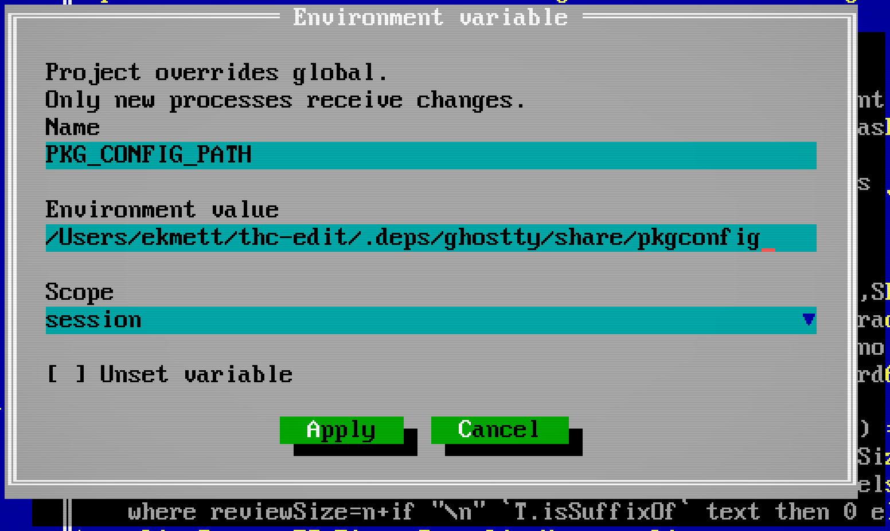

# Configuration

Set the way you want the editor to open once, then launch it with a file or project path. The shared Turbo Haskell configuration file is `$XDG_CONFIG_HOME/thc/config.toml`, or `~/.config/thc/config.toml` when `XDG_CONFIG_HOME` is unset.

```toml
[editor.defaults]
backend = "metal"
scale = 1.5
screenMode = 259
columns = 120
rows = 50
appearance = "dark"
wordStar = false
wideSectionTitles = false
macKeySymbols = false
blinkCursor = true
crtFilter = true
pixelateUnicode = true
bufferView = "current"
materialIcons = false
streamerMode = false
```

Use `terminal`, `auto`, `metal`, `vulkan`, or `web` for the display backend. `remote` serves the protocol over standard input/output. Scale runs from 1 to 8 in eighth steps. Screen mode 3 defaults to 80×25; 259 defaults to 80×50. Explicit columns and rows override those dimensions. The terminal takes its size from the terminal window.

`wideSectionTitles = true` widens Markdown section headings to two cells per
grapheme. Wide headings use stretch without bold; normal-width headings remain
bold, and italic is preserved in both modes. **Options > Preferences > Wide section titles** changes and saves
the same Display setting. It is off by default; see [display](display.md#text-styles).

In text mode, `macKeySymbols = true` uses ⌃, ⌥, ⇧ and ⌘ in key labels.
You can also set **Options > Preferences > Mac key symbols**, which saves the
choice to the global configuration. ⌥ and ⌘ reserve two character cells; the
terminal cursor is repositioned after each glyph even if its font draws it
narrower. This changes labels, not bindings: terminal shortcuts still use
Control/Alt, and Command remains owned by your terminal application. Native Mac
windows and Mac browsers use symbol labels automatically.

Command-line options override environment variables, which override project defaults, which override global defaults. For example, `THC_EDIT_BACKEND=web` overrides `backend = "metal"`, and `--terminal` overrides both. `--mode` selects its usual dimensions unless `--size` is also supplied. `--no-crt`, `--classic-icons`, `--standard-keys`, `--no-blink-cursor` and `--no-pixelate-unicode` override enabled defaults.

`bufferView` accepts `current`, `changes`, `only-changes`, `side-by-side`, or
`markdown`. Markdown renders `.md` and `.markdown` files; other files open in
Current when this is the default. The radio controls in the Window menu save
this default for newly opened buffers.

Startup defaults apply when a session is created. Resuming keeps that session's editing state; the frontend can still use your chosen backend and scale. To change a running session, use **Options > Preferences**. An agent can read and update non-agent settings through `editor_settings`; its `defaults` object updates the startup section without changing the current session.

## Project configuration

Put `thc.toml` in the project root. It uses the same namespaces as the global
configuration and can live in version control:

```toml
[editor.defaults]
screenMode = 259
columns = 120
appearance = "dark"

[editor.agent]
context = """
This package implements the editor. Keep the public API small.
Run the editor checks for changes to input, layout or rendering.
"""
```

Discovery starts at the named file's directory, the named directory, or the
current directory when no path is given. The nearest `thc.toml` wins. Without
one, the search stops at a Cabal package, `cabal.project`, or Git root; the UI
creates `thc.toml` there. Without a project marker, it uses the starting directory.
Only one project file is loaded; parent projects are not recursively merged.

`[editor.defaults]` is merged key by key over global defaults. Omitted values
inherit; project `false` overrides global `true`. Project defaults apply at
startup. The agent's `editor_settings.defaults` writer still edits the global
file; it does not rewrite the project file.

## Keybindings

Replace commands through the global configuration or a project's `thc.toml`.
Profiles are `terminal`, `graphical` (Linux/Windows native and browser), and
`macos` (macOS native and browser). Every profile is prepared on startup/reload;
changing attachments selects the focused profile and context immediately:

```toml
[editor.keybindings.terminal.source]
"hide.file.save" = ["Ctrl+Shift+S"]
"hide.file.open" = []

[editor.keybindings.terminal.sidebar]
"hide.sidebar.expand" = ["Ctrl+E"]
"hide.sidebar.down" = []

[editor.keybindings.terminal.conversation]
"hide.edit.copy" = ["Ctrl+Shift+Y"]

[editor.keybindings.terminal.terminal]
"hide.terminal.stop" = ["Alt+F11"]

[editor.keybindings.macos.source]
"hide.edit.copy" = ["Cmd+Shift+J"]
"hide.edit.paste" = ["Cmd+Shift+K"]

[editor.keybindings.graphical.source]
"hide.file.save" = ["Ctrl+Shift+S"]
```

Contexts are `source`, `wordstar`, `dialog`, `sidebar`, `conversation`, `messages`, `debugger` and
`terminal`. A `global` table supplies explicitly configured commands to all of
those contexts where the command and chord belong to the input owner; a context
entry takes precedence over the same global command. Dialogs inherit only their
focus and editing/search actions, and omit chords owned by dialog controls.
Within each table a project entry replaces the global configuration's entry.
An override replaces all shortcuts for its command; `[]` explicitly unbinds it.
Omitted commands retain their inherited defaults. Menu, context-menu and command status labels
show the focused context's effective binding, including an empty label for an
unbound command. Commands remain available through their menus.

Source, conversation and debugger panes retain the standard command defaults.
When WordStar is enabled for a text source, its `wordstar` table owns named
commands such as Save, Open and Undo. Their function-key and existing named
command defaults remain; other Ctrl character keys stay inactive unless assigned.
Movement and selection use `hide.cursor.left/right/up/down` and
`hide.selection.left/right/up/down`. Row edges, document edges and pages use
`hide.cursor.row-start/row-end/document-start/document-end/page-up/page-down`
and matching `hide.selection.*` IDs. Home/End keep row edges, Ctrl+Home/End
keep document edges, and PageUp/PageDown keep the existing view page size. Shift
extends selection; other existing modifier aliases retain their defaults. Adjacent deletion uses
`hide.edit.delete-backward` and `hide.edit.delete-forward`. Arrow keys,
Shift+arrows and Backspace/Delete keep their defaults. Word movement uses
`hide.cursor.word-left/right` and `hide.selection.word-left/right`; word deletion
uses `hide.edit.delete-word-backward/forward`. Ctrl+Left/Right and
Ctrl+Backspace/Delete retain their source defaults, with Shift extending movement.
Hex retains one-byte movement/deletion; plugin and rendered Markdown views retain
one-grapheme movement and refuse deletion. WordStar adds Ctrl+S/D/E/X
to horizontal/vertical movement and Ctrl+Y to `hide.edit.delete-line`; their
Ctrl+Shift variants retain the same non-extending movement or line deletion.
These commands can be replaced or unbound. Ctrl+Alt+E retains the Edit menu and
Ctrl+Alt+X retains Exit. WordStar Ctrl+A/F aliases and Ctrl+K/Ctrl+Q prefix/block
grammar stay fixed. Overrides using those owned chords fail validation. Global
chords owned by this grammar are omitted from its inherited map, preserving their
use in other contexts. Prefix command steps remain available even when the same
named command is rebound or unbound in the table. WordStar Ctrl+A/F aliases and
configurable prefix/block grammar remain open in #3. Hex buffers use `source`.
For example, `[editor.keybindings.terminal.wordstar]` with
`"hide.file.save" = ["Ctrl+Shift+J"]` replaces F2 for WordStar sources only.
For example, the `wordstar` table can rebind movement and selection:

```toml
[editor.keybindings.terminal.wordstar]
"hide.cursor.left" = ["Ctrl+Shift+J"]
"hide.selection.left" = ["Ctrl+Shift+I"]
"hide.cursor.up" = ["Ctrl+Shift+P"]
"hide.edit.delete-line" = ["Ctrl+Shift+U"]
```

Removing a command's list consumes its former default keys instead of replaying
hardcoded editing. A global Save override using Ctrl+Shift+S must explicitly
release its WordStar owner with `"hide.cursor.left" = []` in the `wordstar` table.
Hex and read-only Markdown/plugin windows keep their existing byte-row or
displayed-text coordinate and selection owners; read-only windows cannot delete, and Delete line
is only available in editable text sources.

The sidebar additionally binds Up/Down and PageUp/PageDown to row movement,
Enter to activate, Right to expand, Left to collapse, and F6 to return to source.
Messages uses its own row/page movement, Enter to jump to source, and F6 to leave.
PTY windows retain window/build shortcuts while ordinary keys, including Ctrl+C,
Ctrl+Q and Ctrl+S, reach the process. Global Ctrl character chords are omitted from PTY maps, so a global Save override
such as Ctrl+Shift+S still applies to the other contexts. A mixed global list
retains its transferable PTY chords. Explicit terminal-context Ctrl character
assignments fail validation.

Use canonical IDs in [the command catalog](../src/Hide/Commands.hs), with Ctrl,
Alt, Shift and graphical Cmd modifiers and names such as F2, Insert, Delete, Left and PageDown.
Unknown contexts or commands, malformed chords and conflicts stop configuration
loading. To assign an occupied key, remove or replace its previous command's
binding too. Ordinary text, menu mnemonics, window navigation, completion controls,
Escape, F10 and Ctrl+] remain reserved. Conversation Enter retains the configured
Query/Steer and code-block submission behavior. Dialog `dialog` tables accept only Copy, Cut, Paste, Select all, Undo, Redo,
Find, Replace, `hide.dialog.focus-next` and `hide.dialog.focus-previous` canonical
command IDs. Editing actions apply to an editable
TextArea; Find/Replace apply to a search dialog. Plain single-line `Input`
fields retain their existing text/editing controls and Ctrl/Alt button mnemonics. Defaults are Ctrl+C/X/V/A,
Ctrl+Shift+C/X/V/A, Ctrl+Z Undo, Ctrl+Y and Ctrl+Shift+Z Redo, Ctrl+F Find,
and Ctrl+H/R Replace, with the macOS Cmd counterparts. Only permitted actions
are projected to native/browser accelerators for the current field. For example:

```toml
[editor.keybindings.macos.dialog]
"hide.edit.copy" = ["Cmd+Shift+J"]
"hide.edit.paste" = ["Cmd+Shift+K"]
```

Dialog focus defaults are Tab/Alt+Tab for the next control and
Shift+Tab/Alt+Shift+Tab for the previous control. Terminal BackTab uses the same
Shift+Tab binding. These commands also work in single-line fields and button-only
dialogs; leaving an open dropdown commits its preview. Remapping or `[]` removes
the old focus chords. The **Next** status hint shows the effective key and stays
clickable when unbound. For example:

```toml
[editor.keybindings.terminal.dialog]
"hide.dialog.focus-next" = ["F13"]
"hide.dialog.focus-previous" = ["F14"]
```

Dialog editing remaps operate on that field's buffer and undo history. Enter,
Escape, Ctrl+Tab search switching, Ctrl+U input clearing, text, button
mnemonics and permission decisions retain their control ownership. Sensitive
agent/approval controls keep their human authority regardless of a remap.
Source accelerators are inactive while a modal owns input.

Typed commands published through the session's menu registry can use their public
menu contribution ID in the same tables. For example, an extension that publishes
`example.manual` can bind it with `"example.manual" = ["Ctrl+Shift+J"]` in
`[editor.keybindings.terminal.source]`. Contributions have no automatic shortcut;
the menu's descriptive key hint does not activate a chord. Unknown IDs fail initial
loading or reload. A previously loaded ID becomes inert when its registration
retires; a replacement registration receives its own exact lifetime. Bindings are
rebuilt on the session worker as contributions change. `[]` removes the effective
shortcut. Remote native, terminal and browser shortcut packets retain the exact
registration from their displayed frame, so an old queued shortcut cannot invoke a
replacement registered under the same public ID. Native accelerators, popup labels
and inspection use the focused platform/context map. Contributions cannot enter the
dialog editing whitelist or grant agent
authority. Bare commands without a menu contribution remain outside this binding
catalogue.

Choose **Options > Reload keybindings** after editing TOML. Loading and
validation run on the session worker; the existing map stays active until a valid
replacement is ready. A failed reload reports its error and keeps that map.
Changing the working directory while loading requires another reload. Recovery
loads current configuration; attaching to a running session retains its map.

**Options > Inspect keybindings** opens a read-only buffer containing every
command's effective chords for the context focused when inspection was requested.
Unbound commands appear as `[]`. Both operations have canonical IDs
`hide.bindings.reload` and `hide.bindings.inspect` and can themselves be bound.
Agents cannot request a reload. Put remote project settings on the remote host.
Native menus display their effective accelerator with explicit modifiers; additional
chords use the same input resolver. Copy/cut/paste remaps use the system clipboard.
Browser keyboard clipboard defaults use browser clipboard events only while their
configured action still matches. Browser Edit-menu clipboard actions remain semantic
commands. Remapped clipboard requests run after the host resolves their command, so they may require the visible clipboard button when
browser permissions or user activation prevent access. Browser/OS reserved shortcuts
(such as Reload and macOS Hide) cannot be intercepted reliably. Plain macOS Option
characters retain composed text input and cannot be assigned to commands; Cmd+Alt
chords remain distinct. Local graphical scale keys remain reserved.

WordStar Ctrl+A/F aliases, prefix/block grammar, dialog accept/cancel, Ctrl/Command
Tab aliases and single-line Input editing remain subsequent stages of
[configurable keybindings](https://github.com/ekmett/hide/issues/3).

## Environment

**Options > Environment…** lists the running editor's environment. Select a
name and **Edit**, or choose **New**. Set its value and scope, then **Apply**;
**Unset variable** removes it from the environment of future processes.



- **Session** applies immediately and lasts until the editor process exits.
- **Project** saves in the project's `thc.toml`.
- **Global** saves in the shared `thc/config.toml`.

```toml
[editor.environment]
PKG_CONFIG_PATH = "/path/to/library/share/pkgconfig"
OLD_BUILD_OPTION = false
```

Strings are literal values: `$PATH`, `${NAME}` and `~` are not expanded. Read the
current value before extending a search path; use `:` on macOS/Linux and `;`
on Windows. `false` explicitly unsets a variable. On startup, project entries
override global entries, which override the inherited shell environment.
Saving a global entry respects an existing project override. Session changes
can temporarily override either.

New builds, terminals, debugger adapters and agent providers inherit the updated
environment. Already running processes retain their old values: start a new
job or reconnect the affected provider. There is no need to restart the editor.
Agent-provider-specific environment overrides still take precedence.

Agents use `environment_get` and `environment_set`, controlled individually by
**Options > Agent Permissions**. Credential values are redacted in tool results,
and agents cannot write credential variables. Editor session/transport variables,
configuration locations and loader overrides are protected from changes through
this facility. Streamer mode masks the value field. Do not commit secrets in
project configuration; session scope avoids writing values to disk.

For dependencies shared by the project, prefer a checked-in build configuration.
This editor's `cabal.project` already discovers Ghostty installed under
`.deps/ghostty`; see [Installation](install.md#bundled-ghostty-discovery).

## Agent context

Use `[editor.agent].context` in either file for guidance you want supplied to
conversation agents. Global text comes first, then project text. The project
text adds to the global context; an empty project string adds nothing.

**Options > Agent Context** selects **Global** or **Project**, then **Edit** opens
the TOML in a normal editor window with save, undo and multiline editing. Use
triple-quoted TOML strings as above. Save with F2 before sending your next query
or steering message. Guidance is limited to 16,384 characters per scope.

The first query after connecting or resuming supplies the skill catalog and
current context. Later queries and steering messages resend context only when
its saved value changes, including when it is cleared. Queued queries use the
context current when dispatched. Editing context does not submit a query or
interrupt a running response by itself. Invalid configuration stops submission
and retains the query for repair.

Agents can read the effective text and its source paths through `agent_settings`.
They cannot edit this configuration through file or input tools. Context is
sent to the provider, so use it for guidance rather than credentials. Tool
permissions remain global: a project file cannot enable tools or override
**Agent Permissions**.

## Agent limits

Set the maximum active agents in the session and the maximum direct subagents
per agent in the global configuration:

```toml
[editor.agents]
max_agents = 8
max_subagents = 4
```

These are the defaults. `max_agents` accepts integers from 1 to 64 and includes
the main human-managed agent. `max_subagents` accepts integers from 0 to 64;
zero prevents agents from spawning direct subagents. Both limits must allow a
spawn: a free child slot does not bypass the session total.

The discovered project `thc.toml` may lower either global ceiling. Omitted fields
inherit the global value; larger project values do not raise it. Limits are
checked for future spawns. Lowering a limit does not kill agents already running,
but further spawns are blocked until both limits permit them. Invalid types,
out-of-range values or malformed configuration block new spawns until repaired.
Existing configuration writers preserve these settings and unknown sections;
there is no agent tool for changing the limits. `[editor.agent]` remains the
separate namespace for conversation context.

## Streamer mode

Turn on **Options > Preferences > Streamer mode** before sharing your screen,
or start with `--streamer`. Sensitive input values and session keys are masked
on every frontend; their stored values are unchanged. `--no-streamer` turns it
off. This is a user-controlled preference: agents can read its state but cannot
change it through input or settings tools.

Views supplied to agents always redact sensitive values, whether or not Streamer mode is on.
Source files are not scanned for secrets by this display option.

## Agent Permissions

**Options > Agent Permissions** saves each tool's Enable, Prompt or Disable policy:

```toml
[editor.mcp.permissions]
read_buffer = "enable"
build_output = "enable"
buffer_apply_diff = "prompt"
terminal_start = "disable"
```

Read-only tools default to Enable; other tools default to Prompt. Omitted tools retain that default. See [session tools](session-tools.md) for the available services.

The editor stays responsive while loading and saving permissions. Each dispatch,
approval and prepared diff adoption checks fresh policy. Unreadable, oversized or
invalid configuration rejects the tool. A permission save takes effect before
queued requests proceed; closing a loading dialog prevents its late reply from
reopening it. External file edits are observed on the next read, with a finite
read-to-adoption interval rather than atomic revocation.

The editor preserves unrelated settings and comments when saving its own entries. Additional compiler sections can share this file as they are introduced.

## Autocomplete

Completion settings are independent of the main conversation. Choose them in
**Options > Autocomplete**, or set global defaults and project overrides:

```toml
[editor.autocomplete]
provider = "acp" # off, acp, or copilot
executable = "codex-acp"
arguments = "[]" # JSON array of arguments
model = ""
effort = ""
copilotExecutable = "copilot-language-server"
copilotArguments = '["--stdio"]'
debug = false
```

An empty model or effort uses the ACP provider's default. Set `debug = true` to
show the completion conversation in the bottom panel; ACP accepts intent hints
there. Completion stays off until a provider is selected. The Options dialog
updates the project table if it already exists, otherwise global settings. A
project value in `thc.toml` takes precedence. Agents
cannot change these settings or complete their own authentication.
