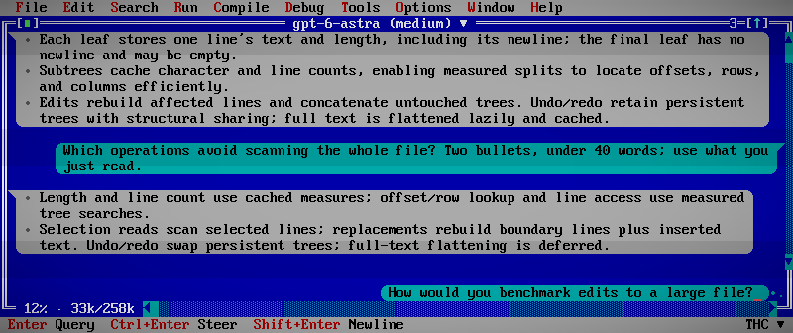
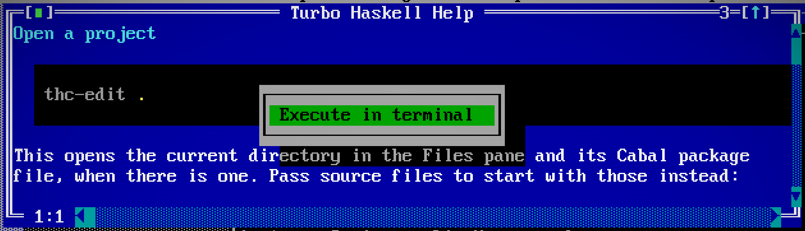

# Conversations

Keep a conversation beside the source you are working on. Ask about selected
text or another open file, including unsaved work, then read the reply and review
proposed changes in the same desktop.

Links in replies work like [documentation links](editing.md#documentation-and-links):
click to open, or drag to select text. Relative Markdown and image links resolve
from the conversation's project directory. Right-click a linked image and choose
**Open** to view it.

## Configure a provider

**Options > Agents** configures an ACP stdio provider. Enter its executable,
a JSON array of arguments and a JSON object of environment overrides. The
executable is launched directly; arguments are not interpreted by a shell.
Authenticate with the provider's own tools before starting it in the editor.

For Codex, install the published
[codex-acp adapter](https://github.com/agentclientprotocol/codex-acp) and enter:

| Field | Value |
| --- | --- |
| Executable | `codex-acp` |
| Arguments | `[]` |
| Environment | `{}` |

The adapter version exercised with the editor is
`@agentclientprotocol/codex-acp@2.0.1`. Its `CODEX_PATH` environment override can
select an existing Codex executable. Provider installation, authentication and
model access are separate from the editor.

Settings remain in the user's legacy `thc-edit` configuration directory. In a remote
session, configure the provider on the remote host, where it runs beside the
project.

## Send a query

Open **Tools > Conversation** (**Ctrl+Shift+C**, or **⇧⌘C** on macOS)
and type in the draft at the bottom. The command focuses the existing conversation
without repainting its history or replacing its draft. Your messages
align right in cyan; replies align left in gray. Code keeps its syntax colors.

[](site/screenshots/conversation.png)

This recorded exchange asks the agent to explain the editor's own buffer implementation.
The screenshot replays the recorded replies and rounded context usage through the current renderer.
The cyan bubble at the bottom is the next draft, not a sent message. Press
**Enter** (Return on Mac) to send it with the default Query setting. The title selects the model and effort; the lower-left
counter reports context usage. Click the double chevron beside a run of tool
calls to see the individual calls, then expand a call to inspect its details.

| Windows/Linux | Mac window/browser | Action |
| --- | --- | --- |
| Enter | Return | Query by default: send, or queue while a reply is active |
| Shift+Enter | ⇧Return | Insert a newline |
| Ctrl+Enter | ⌃Return or ⌘Return | Steer by default, if the provider supports it |
| Escape | Esc | Cancel the active reply |
| Tab | Tab | Browse replies with the keyboard |

Choose **Options > Chat input** to make Enter **Query** or **Steer**;
Ctrl+Enter (⌃Return or ⌘Return on Mac) always uses the other action. Both actions
remain visible in the status bar, including when no reply is running. The setting also lives in the
global or project configuration:

```toml
[editor.defaults]
chatSubmit = "query" # or "steer"
```

Typing while browsing replies returns to the draft. The draft grows with its
contents, then scrolls after twelve visible rows. Draft Undo and Redo remain
available while replies stream. Clickable status-bar actions offer the same
commands. Cancelling the active reply lets queued queries proceed in order.

Click the conversation title, or use **Tools > Conversation model**, to choose
from the provider's advertised models and reasoning settings. Choices are
disabled during a reply and take effect after confirmation. Providers without
these options keep a plain title. The lower-left frame shows reported context
usage, such as `37% · 148k/400k`, or `--` until those values are available.
Child conversations use their own advertised settings and usage; model changes
also wait until their message queue is empty.

Steering keeps the draft until the provider accepts it into the active turn.
Acceptance clears only the submitted draft. Editing or replacing it while a query
is connecting or preparing, or while steering waits, preserves the newer draft
even when its text is identical. Switching conversations keeps each draft with
its original conversation.
If that turn has already finished, use Query to send the retained draft. The
editor does not automatically replay it. A legacy provider that starts an
unowned turn, or fails to confirm the outcome, is stopped; inspect the retained
history before deciding whether to resend.

## Work with live editor context

The editor automatically supplies its built-in MCP server to the ACP provider
when starting or resuming a conversation. There is no separate context picker
to configure. Ask the provider to look at a named file, the source selection or
the open windows; its tools use the editor's current state when called.

| Tool | Available context |
| --- | --- |
| `list_windows` | Window titles, numbers, geometry, active window and side panels |
| `list_buffers` | Open files and untitled buffers, paths and unsaved-change state |
| `read_buffer` | Current text, including unsaved edits, or bytes from a hex buffer |
| `read_selection` | Selected text and cursor offsets in a chosen window |

The agent can also use HLS, inspect diagnostics, arrange windows, navigate text
and hex buffers, preview/apply undo history, build/run/test, and work with shared
terminals. [Session tools](session-tools.md) describe the full interface, including
screenshots, checked diffs and source debugging. Mutating tools work on this live
session; buffer edits and saves are separate actions.

## Read and copy

Drag over reply text to select it. Copying inside one bubble gives plain text;
copying across bubbles adds `User:` and `Bot:` labels. Bubble borders and timestamp
separators are excluded. **Tools > Copy raw conversation** copies the original
Markdown instead. Pauses of five minutes or more get a local timestamp separator.

Right-click a fenced `sh`, `bash`, `zsh` or `shell` code block in a conversation
or Help and choose **Execute in terminal** to run the whole block in the current
project directory. The terminal shows output and accepts keyboard input and
**Ctrl+C**. Execution uses the original code, including tabs and line breaks,
regardless of display wrapping. `console` and `shellsession` examples containing
prompts or captured output are display-only. Empty blocks report an error.



Replies use CommonMark, including highlighted fenced code, lists and tables.
Tables wrap to the available width and become labeled cells when columns no
longer fit. Tool calls appear as compact chevron rows. Click one to expand its
full request/update JSON; click again to collapse it.

An agent can ask a question inline with suggested choices and a free-text answer.
Choose an option or enter your own reply, then submit. Cancel dismisses the
question. Your unfinished conversation draft is retained separately. Free-text
answers are single-line and limited to 4096 characters; pasted line breaks and
tabs become spaces. Normalized or capped insertions remain one Undo step.

## Review requested work

Permission dialogs show the provider's actual choices. **Review** opens a
read-only view of the request; **Tools > Conversation** returns to the pending
choice. Escape denies it.

ACP file-write requests ask for approval, preserve the old buffer in Undo
and use the normal checked save path. If the editor or disk version changed
while the request was pending, the stale write is rejected. These file requests
are bounded by the conversation's project directory.

The provider is a subprocess with its own tools and permissions. The editor's
file boundary does not sandbox that subprocess; configure those permissions in
the provider. With the optional terminal build, ACP terminal requests also ask
before running and use the editor's embedded terminals.

## Continue later

Detach the editor and use `hide --resume` to return to the running desktop,
including its conversation. [Editor sessions](sessions.md) cover this workflow
across native windows, the browser, terminals and SSH.

**Tools > New conversation** (**Ctrl+Shift+N**, or **⇧⌘N** on macOS)
starts a fresh primary conversation directly, including from a child view. **Tools > Resume session**
accepts a saved provider session ID; the latest ID is saved across editor restarts.
These menu actions manage the provider's conversation, independently of the
editor session selected by `--resume`.
Resumption uses capabilities advertised by the provider. Transcript replay
requires provider support for loading the conversation; a provider that only
resumes may continue the session without replaying its earlier messages.

See [Git](git.md) to review the resulting saved changes and [running](running.md)
to use the terminal alongside the conversation.

## Give the agent standing context

Use **Options > Agent Context** to edit global or project guidance in TOML. Global
context applies across projects; a project's `thc.toml` adds its own instructions.
Save before sending a query or steering message. The editor supplies changed
context without adding it as a visible user bubble. The agent can read the
effective guidance but cannot rewrite it. See [Agent context](configuration.md#agent-context)
for the format and precedence.

Agents receive a small [skill catalog](agent-skills.md) on their first query and
can load task workflows through the documentation tools. The
[operation reference](agent-tools.md) gives the corresponding calls by category.

## Complete code while you edit

Choose **Options > Autocomplete** and select **ACP** or **Copilot**. Completion
has its own provider settings, so your main conversation can use a different
model. Suggestions appear in gray without changing the buffer.

| Windows/Linux | Mac window/browser | Action |
| --- | --- | --- |
| **Alt+\\** | **⌘\\** | Request a proposal at the cursor |
| **Alt+[**, **Alt+]** | **⌘[**, **⌘]** | Browse alternatives; request another when you reach the end |
| **Alt+Right** | **⌥→** | Accept the next word |
| **Tab** | **Tab** | Accept the proposal |
| **Escape** | **Esc** | Dismiss it |

In the graphical and browser frontends, holding **Alt** (**⌥** on Mac) alone for a second also
requests a proposal. Traditional terminals use the explicit shortcut. Moving or
editing invalidates pending suggestions; accepted text goes into the normal undo
history.

ACP completion keeps a private conversation warm between requests. It receives
nearby lines, the cursor position and short recent-edit excerpts, and can read
more of the current file when needed. It receives acceptance feedback on later
requests. Its tools can propose changes but cannot apply them, run programs or
control the editor.

The completion conversation is hidden by default. Enable **Show completion chat** to inspect it beside Messages and terminals. In ACP mode you
can type hints there—such as “keep this allocation-free”—and discuss intent with
the same completion agent. **Enter** (Return on Mac) sends a hint; **Shift+Enter** (⇧Return) adds a newline.
This draft is separate from your main conversation. Closing the transcript keeps
the provider and hint draft; reopening restores the latest output. The transcript
is a read-only window, separate from source buffers. Recovery retains its output
as an inert view and clears the hint draft.

Copilot uses GitHub's `copilot-language-server` executable. Choose **Sign in** in
the autocomplete dialog, then **Continue** when ready to complete the device
flow. The language server manages account credentials; the editor does not put
them in TOML or session recovery. See [Configuration](configuration.md#autocomplete)
for provider settings.
