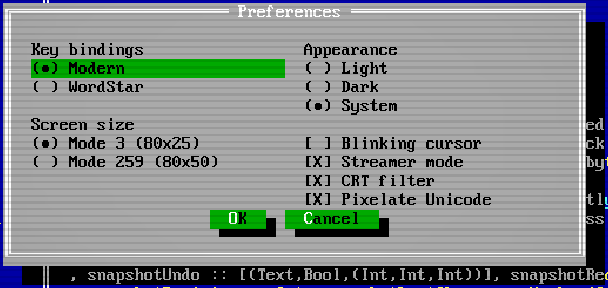

# Display and frontends

Use the same files, windows and commands in a terminal, a native window or the
browser. Choose the display that suits the machine in front of you; a remote
project can use any of these local displays too. Choose another frontend with
`hide --window --resume` or `hide --web --resume` after detaching the
current one; see [sessions](sessions.md).

## Choose a frontend

```sh
hide --terminal .
hide --window .
hide --web .
```

`--window` selects Metal on macOS and Vulkan elsewhere. `--metal` and `--vulkan`
choose explicitly. `THC_EDIT_BACKEND` overrides the backend in
[configuration](configuration.md); without either, the editor uses the terminal. Native and browser builds need their respective
[installation flags](install.md).

The native window and browser use the bundled bitmap font for its repertoire
and system or browser font fallback for other text. The terminal uses its own
font. Combining characters, joined emoji, skin tones and flags are handled as
complete graphemes when editing and clipping; exact rendering follows the
frontend. Wide characters partly covered by a frame become blank cells.

The title shows the active relative filename, a distinguishing session ID prefix,
and the average `ms/frame` over the last 60 actual draws. The timing refreshes
about once a second and keeps its last value while idle. In native windows, input
frames measure the demand through session processing, frame transport and decoding,
and the presentation call. Coalesced input is counted once; input that changes no
visible content adds no sample. Unsolicited frames start at frontend receipt, and
local cursor/expose redraws start at their event. This is not a measurement of when
pixels reach the physical display. Browser timing still measures frontend drawing
and submission; browser GPU execution continues asynchronously.

## Text styles

Markdown headings and strong text use bold; emphasis uses italic. These traits
travel with colors through native, browser and terminal frames. The bitmap font
uses deterministic stroke/slant variants; system fallback fonts use their own
bold and italic faces. Terminal output uses SGR, with the terminal font deciding
the appearance.

**Options > Preferences > Wide section titles** widens Markdown headings to two
cells per grapheme and saves `wideSectionTitles` in `[editor.defaults]`. It is off
by default. Native and browser displays stretch naturally narrow glyphs across
those cells. The terminal uses fullwidth ASCII and ideographic spaces; other
narrow graphemes keep their original text followed by padding. CJK and emoji that
already occupy two cells stay two cells. Combining marks remain attached.

Heading wrapping, selection, cursor movement and links use the same prepared
layout in every frontend. Copy retains the original semantic text, without
fullwidth substitutions or extra wrapping newlines. A resized or replaced view
uses ordinary geometry until its matching layout is ready. Tiled terminal views
never use DEC whole-row width or height escapes.

## Size and scale

Native windows and the browser start in Mode 3, an 80-by-25 character grid.
Use Mode 259 for 80-by-50 with half-height rendering:

```sh
hide --window --mode 259 .
hide --web --size 100x32 --scale 2.5 .
```

**Options > Preferences > Screen size** changes modes while running.
`--mode 0x103` and `--vga50` also select 259. These are Borland text-mode values:
`C80 = 3`, `C80 + Font8x8 = 259`. Both use the same 8-by-16 glyphs at different
vertical aspect ratios.

`--size COLSxROWS` overrides the mode's dimensions, with 40–512 columns and
12–256 rows. Resizing a native window changes its character grid. These options
do not change the dimensions or font of a text terminal.

`--scale` accepts 1 through 8, rounded to 1/8 steps. Ctrl or Alt plus `+` or `-`
changes scale by one step; `=` also increases it. Ctrl+0 or Alt+0 restores the
initial display-aware default. The native default is 2 on standard displays
and 4 at 2× display density. In Mode 259, scale 2 or higher retains every bitmap
row; scale 1 downsamples vertically.

## Appearance

**Options > Preferences > Appearance** offers Light, Dark and System.
Use `--appearance light|dark|system` or `THC_EDIT_APPEARANCE` at startup.
System is the default. Preferences groups key bindings and screen modes on the
left, appearance and rendering controls on the right. Narrow terminals stack
the controls into one column.

In text mode, **Mac key symbols** displays modifier symbols instead of key names.
⌥ and ⌘ occupy two cells. This is a display preference; it does not change which
keys the terminal sends.

[](site/screenshots/preferences.png)

Native windows follow the OS appearance, and the browser follows
`prefers-color-scheme`, including changes while running. Text terminals read
`COLORFGBG` at startup and default to Dark when it is unavailable. The setting
changes document panels such as Help and the default terminal colors; editor,
menu and window-frame colors retain their palette. Explicit terminal colors
remain intact.

**Blinking cursor** controls the insertion cursor. The native cursor blinks
every half second; text terminals use the preference where DECSCUSR is supported.

**CRT filter**, also available as `--crt`, adds scanlines and a vignette.
The native frontend omits scanlines when the glyph rows are too small to keep
text legible. **Pixelate Unicode** fits fallback text into bitmap-sized tiles;
leave it off for full-resolution fallback. The native frontend uses filtered,
dithered tiles, while the browser uses canvas shaping.

Files uses Unicode folder and file symbols, joined by single-line tree branches.
Each nesting level adds one column. `--material-icons` selects bundled Material
folder icons in a native window or browser; in a terminal it needs a Nerd Font
containing Material Design Icons U+F024B and U+F0770.

## Keyboard and clipboard

Use **F10** and letter mnemonics for the in-window menus. On macOS, native menus
also offer Command shortcuts. Option remains available for accented input,
apart from numbered-window and scale shortcuts. If a Mac keyboard treats
function keys as media controls, hold Fn/Globe or enable standard function keys
in System Settings.

Native windows use the system clipboard. The browser also uses the system
clipboard; if permission needs a fresh gesture, click the displayed Copy or
Paste toolbar button to retry.

The browser frontend handles these shortcuts when its editor has focus:

| Action | Windows/Linux | Mac |
| --- | --- | --- |
| Select all | Ctrl+A | ⌘A |
| Undo / redo | Ctrl+Z / Ctrl+Shift+Z (Ctrl+Y) | ⌘Z / ⇧⌘Z (⌘Y) |
| Find / replace | Ctrl+F / Ctrl+H | ⌘F / ⌥⌘F |
| Next / previous match | Ctrl+G / Ctrl+Shift+G | ⌘G / ⇧⌘G |

Browser menu items for Find, Undo and Redo may act differently from these
shortcuts. The [editing guide](editing.md#text-and-selection) explains Mac key
symbols and how text-terminal bindings differ.

**Fullscreen / capture keys** requests fullscreen and Keyboard Lock where
available. Some OS and browser shortcuts remain reserved. Text terminal mouse
and modified-key support depends on the terminal emulator.

## Browser files

Drop a local file into the browser to open it as a new editable buffer. Each
upload is limited to 16 MiB. Its filename is a suggestion for saving, not a path
on the machine running the editor. In a native window, dropping a local file
opens its actual filesystem path. Remote clients upload dropped local files
as new unsaved buffers.

**File > Download** exports the current buffer, including unsaved text or binary
bytes, to the browser's download location. Download does not mark the source file
saved. Use **File > Save** to save on the editor host.

Reloading the page reconnects to the same editor session through the running
frontend process. If you leave
with changed buffers or an unsent query, the browser asks for confirmation;
choose Stay to return and save. **File > Exit** uses the editor's save prompts
and attempts to close the tab. A browser can refuse to close a tab opened
manually, in which case close it after the editor reports that it has exited.

Closing the tab leaves the frontend process running. To release the session
for another display, press **Ctrl+]** in the page and return with `--resume`; see
[sessions](sessions.md). [Remote editing](remote.md) keeps the display local
while files and tools run on another machine.
