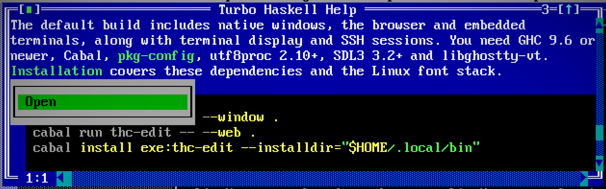
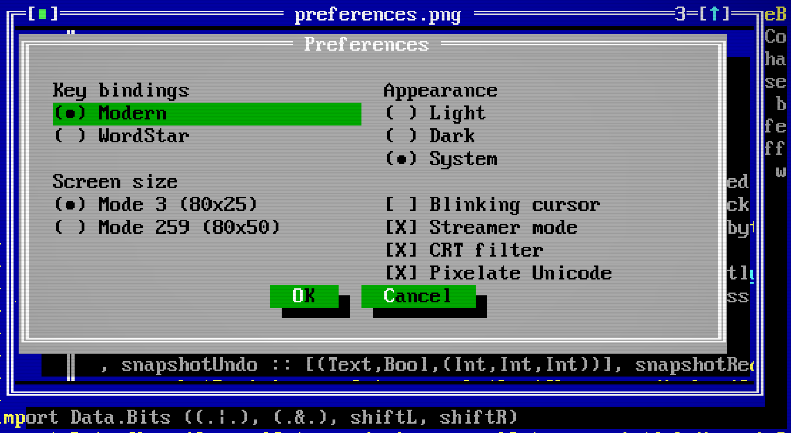
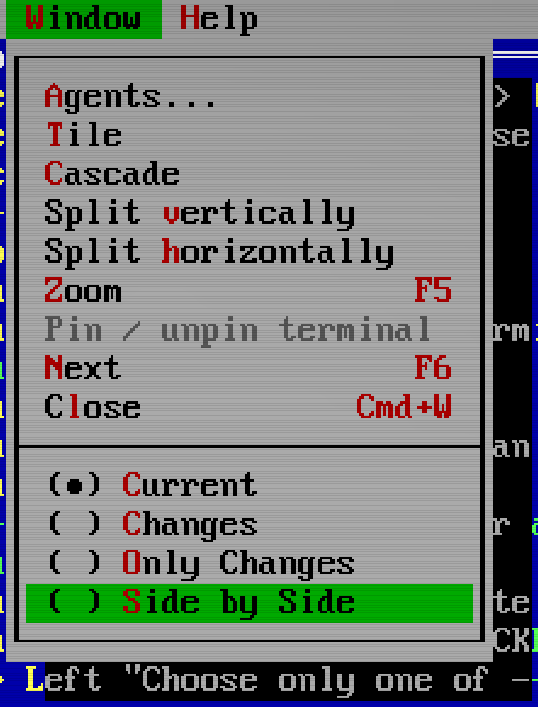
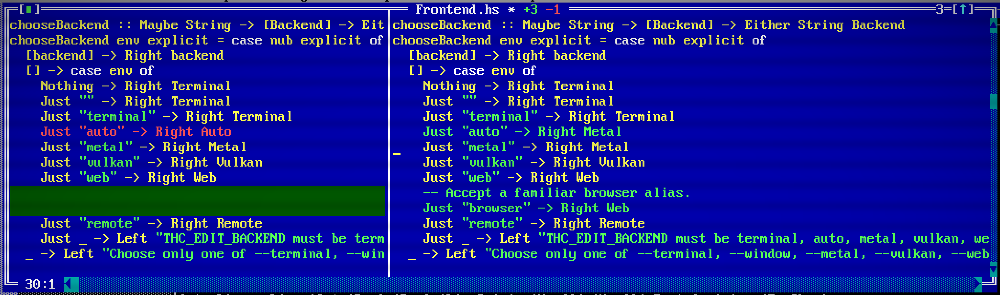
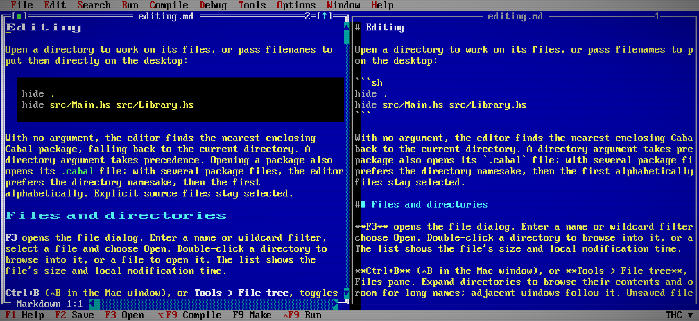
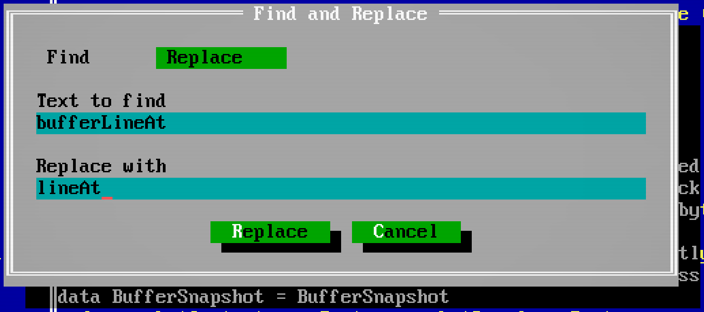
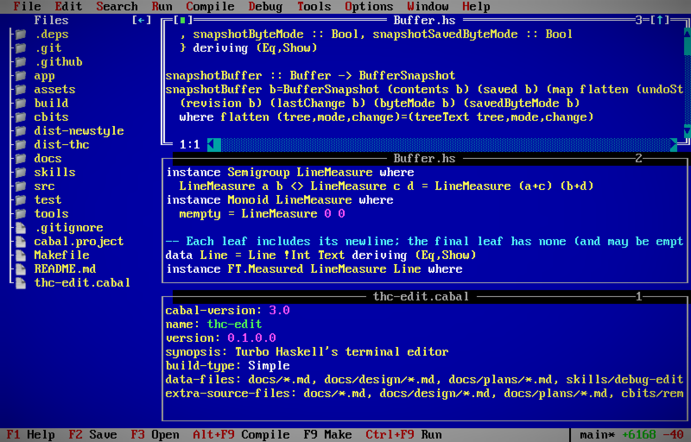
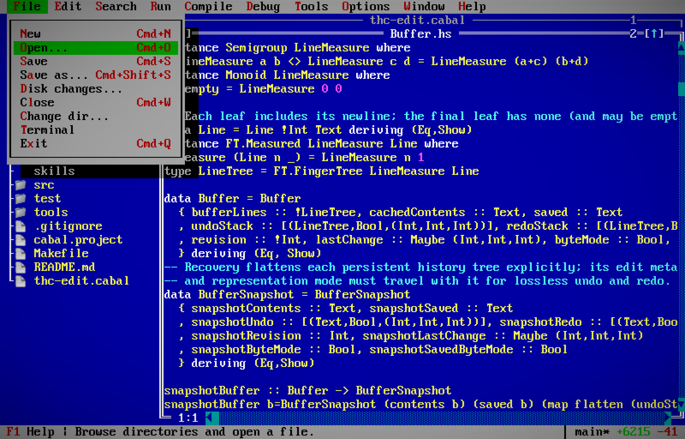

# Editing

Open a directory to work on its files, or pass filenames to put them directly
on the desktop:

```sh
hide .
hide src/Main.hs src/Library.hs
```

With no argument, the editor finds the nearest enclosing Cabal package, falling
back to the current directory. A directory argument takes precedence. Opening a
package also opens its `.cabal` file; with several package files, the editor
prefers the directory namesake, then the first alphabetically. Explicit source
files stay selected.

## Files and directories

**File > Open** (Ctrl+O or F3; ⌘O on Mac) opens the file dialog. Enter a
name or wildcard filter, select a file and choose Open. **File > New**
(Ctrl+N; ⌘N on Mac) starts an unnamed buffer. Double-click a directory to
browse into it, or a file to open it.
The list shows the file's size and local modification time.

**Ctrl+B** (⌃B in the Mac window), or **Tools > File tree**, toggles the
Files pane. Expand directories to browse their contents and open files from the tree. Drag the divider to make
room for long names; adjacent windows follow it. Unsaved filenames appear in
red and return to normal after saving or undoing the change. Their names and
buffer window titles show green `+n` and red `-n` counts for lines added and
removed since opening or the last save. Changing an existing line counts as
one removal and one addition. Split views share these counts; unnamed buffers
show them in their titles too. Saving establishes a new baseline.

Right-click a saved file in Files and choose **Rename…**. Its basename is
selected for replacement. Rename keeps open buffers, their selections and undo
history, and refuses an occupied destination or affected unsaved edits. If the
file changes while the form is open, reopen Rename. This action renames regular
files within the same directory; directory moves remain a separate operation.

**File > Change dir** changes the working directory and refreshes Files without
closing open buffers. Enter browses into the selected directory, Browse opens
a typed path, and OK accepts the displayed directory.

## Cabal packages

The sidebar shows each `.cabal` package in the selected directory as a separate
root beside Files and Agents. Expand a package to browse its library, executable,
test and benchmark targets, then expand a target to open its source files.
Right-click the package name to open its package description. For component
actions, including Debug and GHC Test/Benchmark, see
[running from the sidebar](running.md#compile-make-run).

Source entries follow Cabal declarations, including common stanzas and conditional
source directories. A `?` marks conditional entries; multiple existing candidates
expand into their paths. Generated, virtual and missing sources remain visible.
Opening a source reuses an existing buffer, preserving unsaved edits.

Package descriptions refresh after changes on disk. Discovery currently covers
the selected directory; it does not require a build or a Cabal plan.

## Documentation and links

**F1** opens the rendered README. Click a colored link such as
**Installation** to open that Markdown document in Help. Relative links follow
from the document you are reading, including links back up to its parent
folder. Drag across a link to select its text without opening it.

Web links open in your browser. Right-click a linked screenshot and choose
**Open** to view it. In Files, **Open externally** hands a supported file to
the connected frontend; the ordinary file action chooses its editor window. In a browser session, external links and images open in a new tab;
if popup blocking prevents that, click **Open link** above the editor.
Linked Markdown and transferred images/PDFs are limited to 8 MiB each.

[](site/screenshots/documentation-links.png)

## Images



Open an image from Files, the file dialog or the command line, or drop it into
the editor. PNG files open in an image window, fitted to its size. Press **F**
to fit again, **1** for actual size, or **+** / **−** to zoom. The wheel zooms; arrow keys and dragging
pan. Resize or tile it like a source window.

Metal, Vulkan and browser frontends keep the image crisp over the optional CRT
filter. Other windows, menus and dialogs cover it normally. In a text terminal,
the window shows its name, dimensions and an **Open externally** link. That link
opens through the connected frontend, including when the editor runs over SSH.

The viewer reads the saved PNG without changing an open buffer. It accepts files
up to 16 MiB, 4096 pixels per side and four megapixels. Image windows share a
64 MiB decoded-pixel budget. Private images follow the same streamer and agent
visibility rules as other protected content. Session recovery retains a short
unavailable-image description; reopen the file to load its pixels again.

## Buffer views

The section at the bottom of **Window** changes how the selected source window
displays its contents:

- **Current** shows the editable file with deleted text hidden.
- **Changes** includes deleted originals in red and additions in green.
- **Only Changes** keeps two unchanged lines around each changed region and
  folds the rest behind omission markers.
- **Side by Side** aligns saved text on the left and current text on the right.
  Red and green blank regions show where the other side has no corresponding
  line. Drag the center divider to give either side more room.
- **Markdown** renders headings, lists, tables, links and code blocks in `.md`
  and `.markdown` files. It shows the current buffer, including unsaved edits.

Click a view name to change this window. Click its radio control, or highlight
the row and press Space, to choose the default for newly opened buffers. The
default is saved in the existing THC configuration; other open windows keep
their views. Split views share edits and undo history but can use different views.

[](site/screenshots/window-views-menu.png)

[](site/screenshots/side-by-side.png)

Deleted text and the saved side can be selected and copied. The editing caret
stays in current text; Cut removes only selected live text and does not delete
lines hidden by Only Changes. Right-click a changed region and choose
**Revert this change** to restore its originals and remove its additions in one
undoable operation. Saving establishes a new baseline and clears the change view.

### Reading Markdown

Open a Markdown file and choose **Window > Markdown**. Select and copy the
rendered text, or follow links relative to the file's location. **Options >
Preferences > Wide section titles** applies here as it does in Help. In
**Current**, the file keeps its Markdown syntax and normal source highlighting.

The Markdown view is read-only. Switch back to **Current** to edit; your source
cursor, selection and scroll position are preserved. You can also split the
window, keeping Current in one half and Markdown in the other. Edits refresh
the preview in the background. Both windows share the same file and undo history.
Resizing or refreshing the preview clears its rendered selection; it does not
change your source selection.

[](site/screenshots/markdown-view.png)

## Text and selection

Type to insert text. Hold Shift while moving to select it, or drag with the
mouse. The Mac column below describes the native window and browser:
⌃ Control, ⌥ Option, ⇧ Shift and ⌘ Command. Text terminals use the Windows/Linux bindings when their
emulator forwards them; Command shortcuts belong to the terminal app.
**Options > Preferences** can display Mac modifier symbols in text-mode key
labels. It keeps the actual Control/Alt bindings; it does not remap them to
Command. The choice is saved in [configuration](configuration.md).

Mac shortcuts follow [Apple’s modifier order](https://developer.apple.com/design/human-interface-guidelines/keyboards):
Control, Option, Shift, Command (⌃⌥⇧⌘). Symbols are joined without plus signs,
so redo is ⇧⌘Z and Replace is ⌥⌘F. Return is the main key labeled Enter on
Windows keyboards; Esc cancels. Shortcuts written with Ctrl or Alt elsewhere in
this guide still mean Control or Option on Mac, unless a Mac alternative is given.
Command is a separate key. See [keybinding configuration](configuration.md#keybindings)
to replace or unbind commands, reload the bindings and inspect the effective map.

| Action | Windows / Linux | Mac |
| --- | --- | --- |
| Move by word | Ctrl+← / Ctrl+→ | ⌃← / ⌃→ |
| Select by word | Ctrl+Shift+← / Ctrl+Shift+→ | ⌃⇧← / ⌃⇧→ |
| Copy / cut / paste / select all | Ctrl+C / Ctrl+X / Ctrl+V / Ctrl+A | ⌘C / ⌘X / ⌘V / ⌘A |
| Undo / redo | Ctrl+Z / Ctrl+Shift+Z (Ctrl+Y) | ⌘Z / ⇧⌘Z |
| Start / end of file | Ctrl+Home / Ctrl+End | ⌃Home / ⌃End |

Ctrl+Insert, Shift+Delete and Shift+Insert also copy, cut and paste. Split views
share text and undo history; each view keeps its own cursor and selection.
UTF-8 text retains its line endings, including CRLF. Combining sequences and
joined emoji move and delete as complete graphemes; your terminal or selected
frontend supplies their appearance.

Choose **ACP** or **Copilot** from the **Provider** dropdown in
**Options > Autocomplete** for inline suggestions. Choose **Off** to disable them.
Click the field or press Enter to open it, use the arrow keys to choose, and
press Enter to select or Escape to cancel.

| Action | Windows / Linux | Mac |
| --- | --- | --- |
| Request a suggestion | Alt+\ | ⌘\ |
| Previous / next alternative | Alt+[ / Alt+] | ⌘[ / ⌘] |
| Accept all / next word | Tab / Alt+→ | Tab / ⌥→ |
| Dismiss | Escape | Escape |

Holding Alt (⌥ on Mac) alone for a second requests a suggestion in a native
window or browser. Modifier-only holds are unavailable in text terminals.
The explicit Mac completion shortcuts also work in the browser; Option remains
available for composed text. HLS identifier completion is a separate action on
Ctrl+Space (⌃Space), subject to OS shortcut interception.

Syntax highlighting follows the filename. Haskell, C, C++, Cabal files and over
100 other languages use Skylighting's language definitions. New unnamed text
buffers start with Haskell highlighting; unknown extensions use plain text.
Colors update in the background after edits; the current text remains visible
while coloring is pending. A slow coloring job leaves plain text until the next
edit, and results from older text are discarded.

The native window and browser use the system clipboard. Text terminals keep an
editor-local clipboard and request a system clipboard write through OSC 52 on
Copy and Cut. Whether that reaches your system clipboard depends on the terminal.
Use the terminal's paste command for external text. See
[frontend controls](display.md) for browser shortcut differences and clipboard
permissions.

## Search

| Action | Windows / Linux native window or terminal | Mac native window |
| --- | --- | --- |
| Find / replace | Ctrl+F / Ctrl+H (Ctrl+R) | ⌘F / ⌥⌘F |
| Next / previous match | Ctrl+L / Ctrl+Shift+L | ⌘G / ⇧⌘G |
| Go to line | Ctrl+G | ⌃G |

Find and Replace share a dialog: click either tab or press Ctrl+Tab (⌃Tab) to
switch without losing the search or replacement text. The corresponding
Find/Replace shortcut also switches tabs. Search is literal and case-sensitive;
Replace changes one match.

[](site/screenshots/find-replace.png)

In the browser, Ctrl+G / Ctrl+Shift+G (⌘G / ⇧⌘G on Mac) find the next and
previous matches; use **Search > Go to line** for a line number. Browsers retain
Ctrl+R (⌘R on Mac) for Reload,
and native Mac ⌘H keeps Hide. F3 still opens files. Embedded terminals retain
control keys while the terminal has focus; native Mac menu shortcuts still
invoke their editor commands.

## Windows

Use **Window > Split vertically** or **Split horizontally** to keep two parts
of a file visible. A split is another view of the same file, so an edit or Undo
in either window appears in both.

[](site/screenshots/split.png)

Drag a title to move a window, a frame edge to resize that side, or the
bottom-right corner to resize both dimensions. **Window > Tile** arranges
windows alongside one another; **Cascade** staggers them. **F5** zooms the active
window. During a move or resize, arrows move, Shift+arrows resize and Enter
finishes. Escape restores all windows affected by the drag.

Touching edges stay together when you drag a title or move a divider. Equal sides
share the divider; a smaller window whose whole side touches the edge moves with it. Once
that window reaches a desktop boundary, its outer edge stays there and further
divider movement resizes it. The same rule carries a chain of touching windows.
Partial overlaps stay independent, and a diagonal corner drag breaks the contact.

Windows touching a desktop edge grow with that edge when the desktop grows.
Floating windows keep their position and size. Dragging a title preserves size
while there is room, then shrinks the window against the desktop or dock boundary.
Files and Messages remain the boundaries for adjacent windows.

| Action | Windows / Linux | Mac native window |
| --- | --- | --- |
| Next / previous window | Ctrl+Tab (F6) / Ctrl+Shift+Tab | ⌃Tab (F6) / ⌃⇧Tab |
| Activate numbered window | Alt+1…9 | ⌥1…9 |
| Zoom | F5 | F5 |

Each editor and Messages window has a stable number.

**Alt+Tab** cycles the menu, Files, windows and Messages; Shift reverses it.
Some operating systems reserve this shortcut. Click the destination or use the
window shortcuts when the OS intercepts it.

## Menus and dialogs

**F1** opens the bundled guide. Press **F10** to enter the menu bar, then use
arrows or letter mnemonics.
The status bar describes the highlighted action. Its key labels are clickable.
**Help > About hide** identifies the application as a Haskell IDE; **F1** opens
**hide Help**. On macOS, **Haskell > Settings…** (⌘,) opens
**Options > Preferences**, and **Haskell > About Haskell** opens the same About
dialog. The native menu bar provides ⌘ shortcuts. Other Control bindings remain Control; ⌘ is not a universal substitute. Function keys may need Fn/Globe.

Right-click the macOS Dock icon to use **Editor windows** above **Options**.
The list includes open editor views and docked terminal tabs, checks the selected
view, and follows title changes. Choosing a row focuses that view and restores a
minimized native window. Rows are unavailable while a dialog or human question
owns input.

[](site/screenshots/file-menu.png)

Tab and Shift+Tab (⇧Tab on Mac) cycle dialog controls. Enter (Return on Mac)
accepts and Escape (Esc) cancels.
Ctrl or Alt plus a button's marked letter activates it. In the native Mac
window, use Control with the letter; Option keeps its text-entry role. Dialogs also accept
Alt+Tab for focus traversal. Mouse buttons activate when released over the
button; releasing outside cancels the click.

## Save, close and external changes

**F2** or **Ctrl+S** (⌘S on Mac) saves. **File > Save as** (⇧⌘S) writes
under a new name and refuses to replace an existing destination. **Alt+F3**
(⌘W) closes the current window; **Ctrl+Q** or **Alt+X** (⌘Q) exits. Closing the
last view of a changed file, or exiting with changed files,
asks what to save. **File > Exit** ends the editor session. To leave the desktop
running, detach and use `hide --resume` later; **Ctrl+]** detaches from the
terminal frontend. See [sessions](sessions.md) for the other frontends.

A title star means the buffer has unsaved edits. The branch badge's star means
saved changes in Git; saving a buffer can clear one while setting the other.

The editor watches open files and expanded directories. A clean buffer reloads
when the file changes on disk, retaining Undo. If the buffer also has edits, or
the file was deleted, the editor keeps the versions and offers:

| Choice | Effect |
| --- | --- |
| Compare | Inspect the editor, last-saved and disk versions |
| Reload | Use the disk version |
| Keep | Keep editing your version without overwriting the disk file |
| Save as | Write your version under another name |

**File > Disk changes** reopens the conflict. Keep does not accept the new disk
contents as a save baseline: the next Save still checks the conflict. Repeated
observations of the same change do not repeatedly interrupt you. These checks
also apply after Git operations and conversation edits.

## WordStar keys

Select WordStar under **Options > Preferences**, or start with `--wordstar`.

| Action | Windows / Linux | Mac |
| --- | --- | --- |
| Up / left / right / down | Ctrl+E / S / D / X | ⌃E / ⌃S / ⌃D / ⌃X |
| Previous / next word | Ctrl+A / F | ⌃A / ⌃F |
| Delete line | Ctrl+Y | ⌃Y |
| Mark block start / end | Ctrl+K, then B / K | ⌃K, then B / K |
| Copy / cut / delete block | Ctrl+K, then C / V / Y | ⌃K, then C / V / Y |
| Save / close | Ctrl+K, then S / D | ⌃K, then S / D |
| Start / end of line | Ctrl+Q, then S / D | ⌃Q, then S / D |
| Start / end of file | Ctrl+Q, then R / C | ⌃Q, then R / C |
| Find / replace | Ctrl+Q, then F / A | ⌃Q, then F / A |

These are defaults. Configure the starters in `wordstar` and second strokes in
`wordstar-block` / `wordstar-quick`; see [keybinding configuration](configuration.md).
Second letters also accept Ctrl and Shift. Escape cancels a prefix; unknown or
unbound steps end it without editing. Alt/Command menu and platform shortcuts
retain their own priority.

See also [Haskell tools](haskell.md), [Git](git.md) and [hex editing](hex.md).
