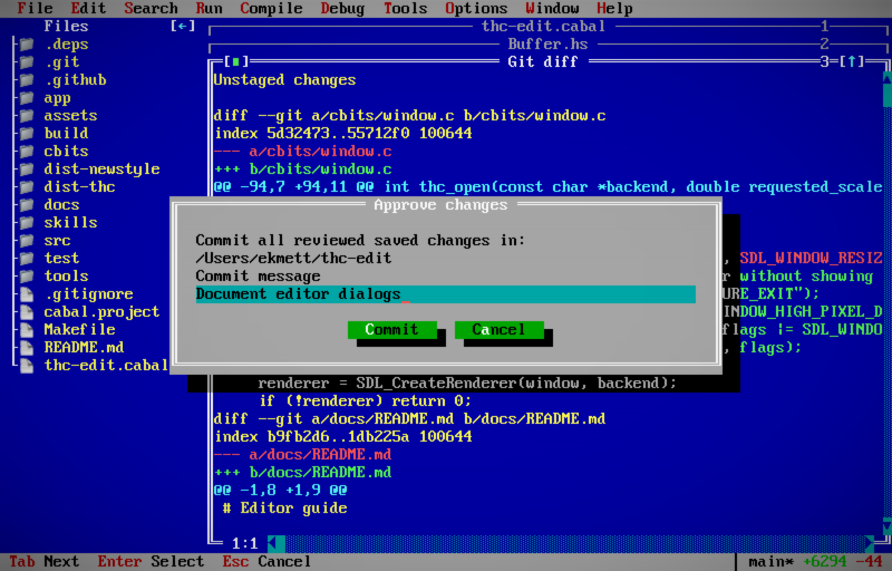

# Git

Review the saved changes in a repository, commit them, and bring in work from
other branches without leaving the editor.

## Read the changes

**Tools > Git diff** opens a colored review of staged, unstaged and untracked
saved changes. Save the buffers you want included before opening the diff.

The status bar shows the branch and counts of added and deleted lines, including
untracked text. A `*` beside the branch means saved repository changes. A star in
a file's title means unsaved buffer edits. Open, save and Git operations refresh
the badge.

## Commit a review

1. Save the changed buffers.
2. Open **Tools > Git diff** and read the changes.
3. Choose **Tools > Approve changes** and enter a commit message.

Approval stages and commits **all reviewed saved changes in that repository**,
including new files and deletions. It is a repository-wide review. The command
does not push.

If files or the index changed since the review, refresh the diff before trying
again. Git hooks run normally. If a hook changes the committed tree, the editor
reports that so you can inspect the result. A failed commit keeps the files on
disk and may leave changes staged. Commit submodule changes with Git directly.

## Fetch, pull and merge

Right-click the branch badge for **Fetch**, **Pull** and **Merge**. Pull accepts
a fast-forward. Merge asks for the branch to merge. Operations run in the
background and open a result window when finished.

Save changed buffers before Pull or Merge. Clean buffers refresh when their
files change; edits made while the operation runs remain in the editor. Resolve
merge conflicts in the affected files and use Git as needed, then review again.
The editor waits for a running Git operation before exiting.

[External change handling](editing.md#save-close-and-external-changes) applies
here too. A file changed by Git does not silently replace unsaved work.
