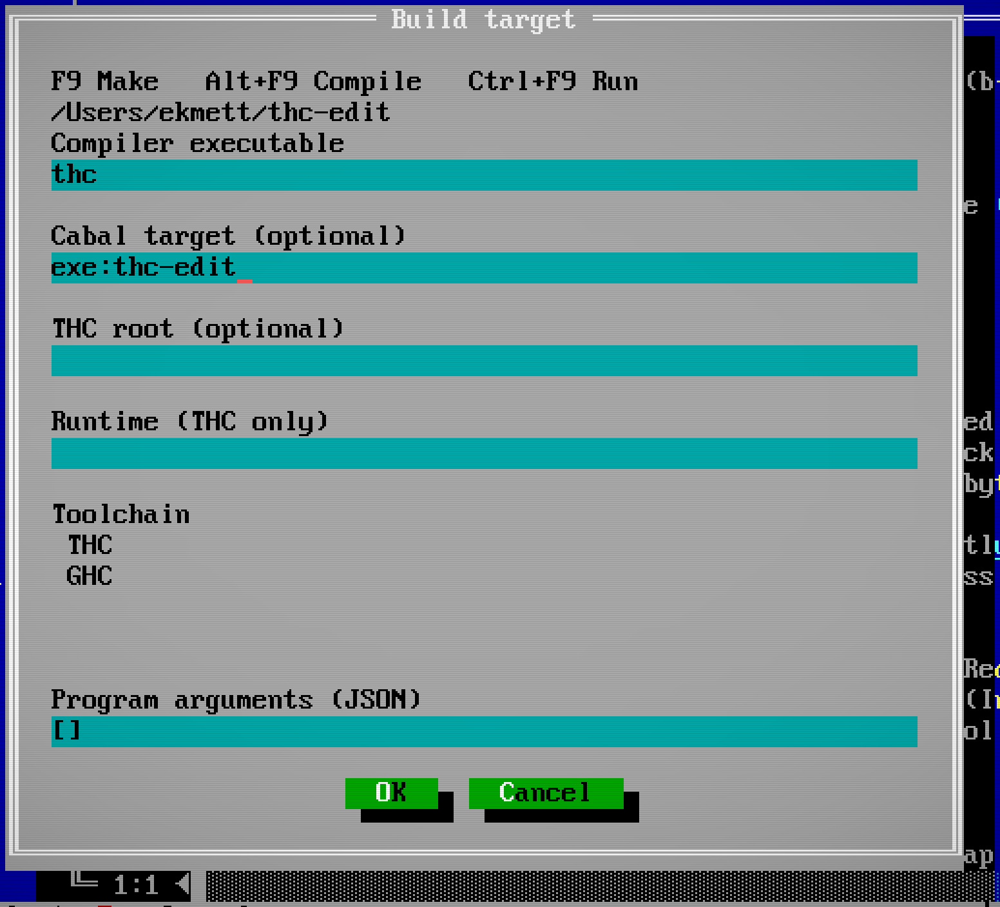
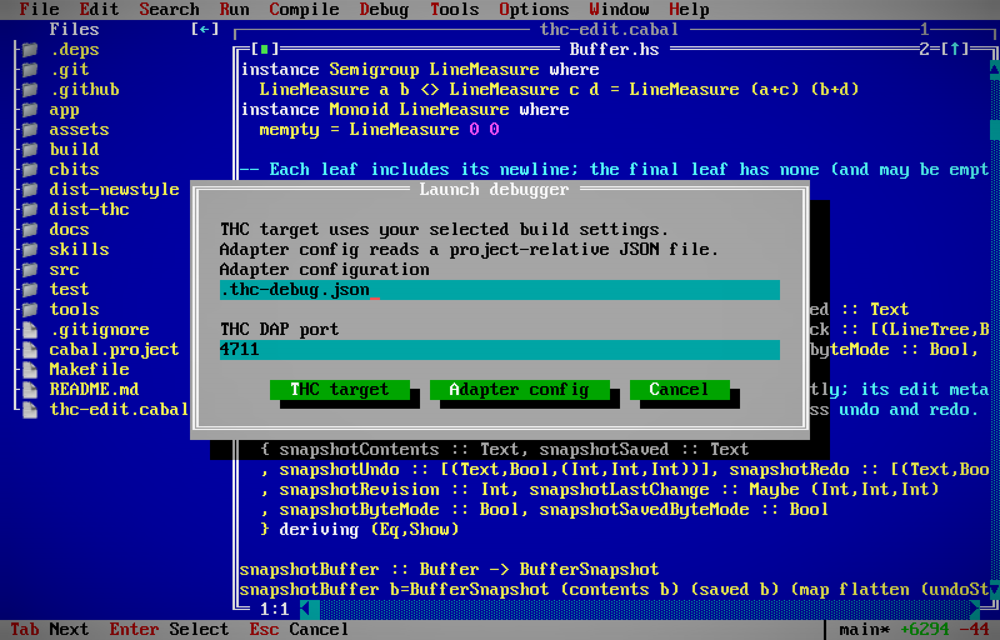
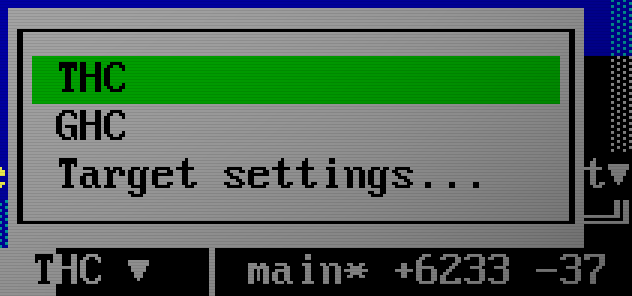
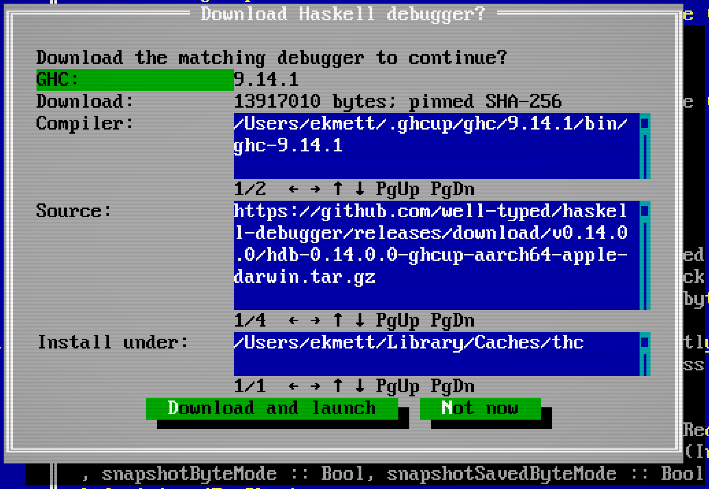
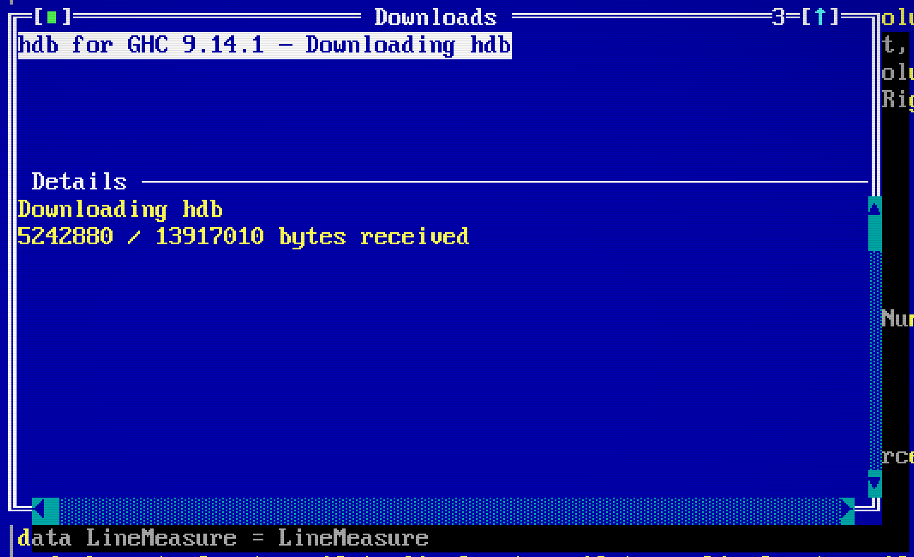
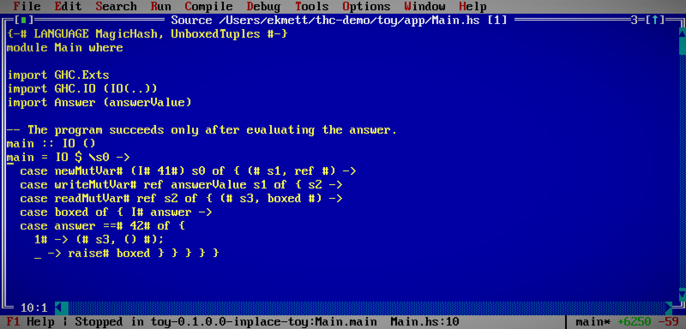
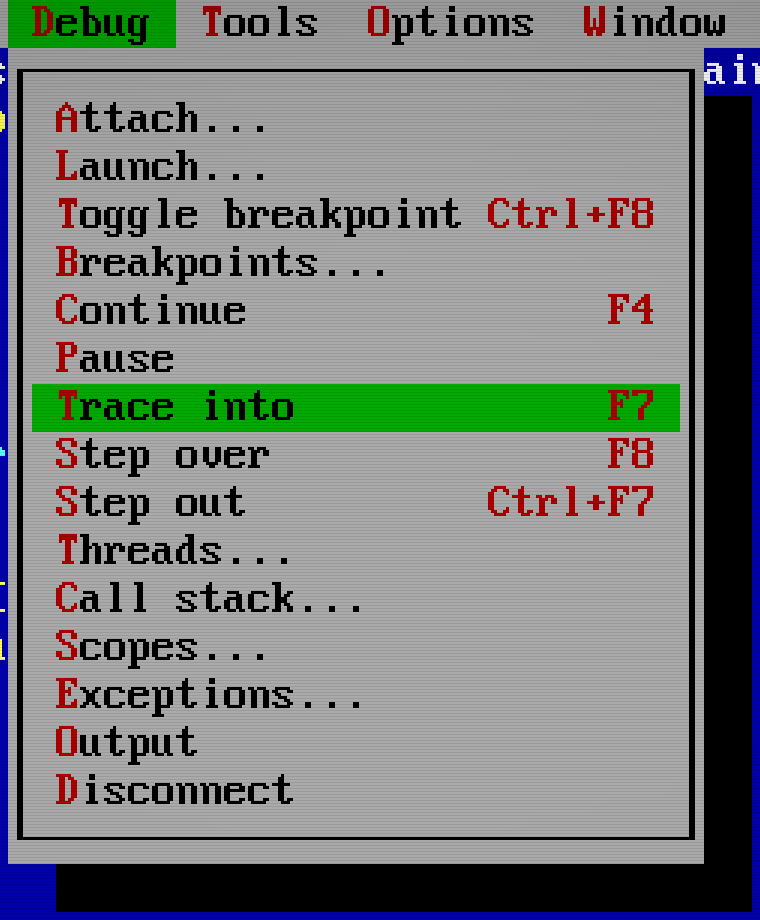
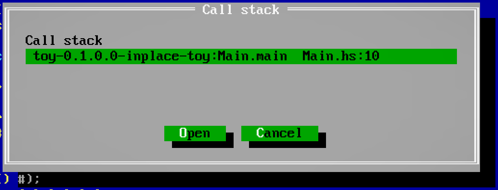

# Running and debugging

Keep program output beside the source, use a shell for project commands, and
attach a debugger when you need to stop and inspect execution.

## Compile, make, run

Choose **Run > Target** (also **Compile > Target**) to select **THC** or **GHC**,
the compiler executable, and an optional Cabal target such as
`package:exe:program`. Save your source files, then use:

| Action | Windows/Linux | Mac | What it does |
| --- | --- | --- | --- |
| Compile | Alt+F9 | ⌥F9 | Compile the selected package target; check a standalone GHC source file |
| Make | F9 | F9 | Build the selected package target or standalone executable |
| Run | Ctrl+F9 | ⌃F9 | Build and run the selected program |

On Mac, hold Fn or the Globe key as well if the function keys control media
or hardware settings. Ctrl and Alt shortcuts below mean ⌃ Control and ⌥ Option,
respectively; Command is not a substitute.

These actions are also clickable in the ordinary status bar. Compile and Make
open an output window; output arrives while you keep editing. Compiler errors
and warnings appear in **Messages**, where **Alt+F8** and **Alt+F7** move between
source locations. **Compile > Stop build** stops the current job.

Captured Build/Run output opens a read-only text window independent of source
buffers. It supports selection, copy and scrolling; output follows the bottom
until you scroll away. Later output can refresh behind a dialog without changing
its input or focus. A new captured job reuses its output view geometry with a fresh content lifetime. Completed output is retained in checkpoints as an ended read-only view; recovery
does not restart its process or restore a live job ID. Closing the view
keeps the job running and prevents late output from reopening it; use **Compile > Stop build** or **Run > Stop build/run** to stop it. Agents can page the last job’s combined output with
[`build_output`](agent-tools.md#build-test-and-execution).

For THC, Compile and Make invoke `thc build`: Cabal builds the selected
component and THC acquires its dependency Core. Leave the target empty to build
the current package, or name a Cabal library or executable target. Run invokes
`thc run`, which selects a runnable component and acquires anything it needs.
Use a THC version with the `build` command. For GHC projects,
the editor uses `cabal build` and `cabal run` with the selected compiler.
Outside a Cabal project, Compile checks the current `.hs` or `.lhs` file with
`ghc --make -fno-code`, Make compiles the module (and links an executable for
`Main`), and Run uses
`runghc` with the selected GHC.

The target dialog also accepts an optional THC root and runtime path, and
program arguments as a JSON array, for example `["input.txt", "--verbose"]`.
Arguments go directly to the process; shell syntax is not interpreted. Settings
live in the user configuration directory. The Cabal target belongs to the
selected project, while the compiler installation is shared.

[](site/screenshots/build-target.png)

Run uses an embedded terminal when the [terminal build](install.md#embedded-terminal)
is available. Basic builds capture output without interactive input; **Run >
Stop build/run** stops a captured run. All commands execute on the session host,
including over SSH. Detaching the display leaves an active build or run intact.

## Shells and output

**File > Terminal** opens the configured shell in the project directory.
Ordinary keys and paste go to the focused terminal. **Ctrl+C** interrupts its
foreground job; raw-mode programs receive the control byte themselves.
F5, F6, F10, numbered-window
shortcuts and menu controls stay with the editor. Resizing the terminal window
resizes its PTY; output supports colors, attributes and Unicode.

Click the terminal title bar's cyan **[ ]** control, or choose **Window >
Pin / unpin terminal**, to dock it at the bottom. Messages and pinned terminals
share one panel with tabs. Click a tab or use the existing numbered-window/F6
shortcuts to focus a terminal; hidden tabs keep receiving output. Drag an unused
part of the panel's top border to resize the shared panel. The cyan **[P]**
control restores the terminal's floating window, constrained to the current
screen and Files panel. Pinning preserves the process, window number, buffer
and selection. Tile and Cascade arrange the floating windows only.

The Messages collapse arrow hides its tab; pinned terminals keep the panel
open. A recovered checkpoint retains these tabs as **Ended Terminal** views
without restarting their processes.

Closing a terminal window leaves its command running. **Run > Stop terminal**
stops the selected process. **File > Exit** cleans up the session's terminal
processes. Detaching the frontend leaves them running; return with `--resume`.
ACP terminal requests use the same backend, with approval before execution.

## Launch or attach a debugger

**Debug > Launch** offers **Selected target** and **Adapter config**. With THC selected, Selected target
uses the THC installation and package selected in **Run > Target**. Choose an
unused loopback port (default `4711`); the editor starts `thc run --dap-port PORT`,
waits for its debugger, and configures your breakpoints before execution.
This requires a THC build with the DAP instrument and `--dap-port` support.
THC's DAP launch defaults to waiting for attachment and suspending initially.
Build output is available in **Debug > Output** while it starts. The first
launch can spend several minutes building and capturing dependencies.
**Debug > Disconnect** stops that work; protocol response timing starts when
the debugger connects.

[](site/screenshots/debug-launch.png)

THC initially stops at an instrumented source location. Embedded source opens
read-only, where **Ctrl+F8** sets a breakpoint in the running program. Both
the AST and bytecode runtimes carry source locations; optimized Core can
repeat or combine locations, so a step need not advance to a different line.
Scopes and values depend on the runtime. Both THC backends have verified source
stops and Continue, but stopped-frame lexical scopes and Haskell watch expression
evaluation remain unavailable. An explicit THC watch evaluation displays a bounded
adapter error; source stepping does not imply evaluation or Force support.

For another debugger, put its command and DAP arguments in `.thc-debug.json`
in the project directory, or choose another configuration path:

```json
{
  "command": ["lldb-dap"],
  "request": "launch",
  "arguments": {"program": "/absolute/path/to/program", "args": []}
}
```

The adapter owns the meaning of `arguments`. Use `"request": "attach"` for an
adapter-specific attach configuration. A TCP configuration replaces `command`
with `"host": "127.0.0.1", "port": 4711`; only loopback endpoints are accepted.
Adapter commands and arguments are passed without a shell.

For GHC debugging, install **hdb** built for your GHC version and use an owned
TCP server configuration. This example runs `main` from `Main.hs`:

```json
{
  "server": ["hdb", "server", "--port", "4711"],
  "host": "127.0.0.1",
  "port": 4711,
  "adapterId": "hdb",
  "request": "launch",
  "arguments": {
    "projectRoot": "/absolute/canonical/path/to/project",
    "entryFile": "Main.hs",
    "entryPoint": "main",
    "entryArgs": [],
    "extraGhcArgs": []
  }
}
```

Choose **Debug > Launch > Adapter config**. The editor starts hdb in the project
directory, sets `DAP_HOST` and `DAP_PORT` in that child process, and connects
when its loopback listener is ready. The server command's port must match the
configuration. Existing listeners are rejected before spawning. Owned server
startup has a five-minute deadline; a DAP launch request has two minutes for
loading/compiling the project. Ordinary requests retain their 15-second deadline.
Use **Debug > Disconnect** to cancel startup or stop the owned session.

hdb uses your project's cradle to load the entry module. Use the canonical
project path (resolving symlinks) and an entry file belonging to that cradle.
Once stopped, use the same breakpoints, stepping, call stack and scopes as THC.

The shared **Debug** sidebar root reveals once for a visible session. Expand a
thread to see its stack, then expand a frame and scope to see locals. Multiple
frames can remain expanded; choosing another frame preserves their stopped-state
handles. Right-click a frame and choose **Go to source** to visit its captured
source. Resume, disconnect or a thread change expires the values and pending
replies. Existing
Debug menu inspection windows remain available.

Stack pages contain at most 128 frames. Scopes and variables currently expose the
first 128 rows; adapters without a variable paging contract cannot silently
produce an unbounded tree. Lazy references display their state without an expand
action, so passive expansion does not force Haskell thunks. Painting, scrolling
and repeated ticks use cached rows and do not fetch or evaluate values.

Right-click source text for **Toggle breakpoint** or **Add watch**. Clicking
inside a selection preserves its expression; elsewhere Add watch prefills the
identifier at the click. Both actions retain that source position and refuse a
changed source rather than acting on a different caret.

**Watches** is a persistent collapsible root beneath Debug, available without a
stopped session. Right-click its root to add an expression, activate a watch to
edit it, or use its context menu to remove it. Expressions survive session
replacement; at most 128 watches with 4096 characters each are retained. Private
source expressions stay masked in the tree and protected in the editor.
Managing watches does not evaluate program code. At a revealed stop, use a watch’s
**Evaluate watch** context action to run its expression in the selected frame.
Results belong to that stop, frame selection and expression revision; changes
make them stale until another explicit evaluation. **Force lazy watch** is a
separate executing action for a known lazy root result. Nonlazy values expand
through bounded read-only pages; nested lazy values remain inert. No evaluation
runs automatically on stop, tree expansion or repaint.

Live hdb 0.14 with GHC 9.14.1 on macOS arm64 has verified scalar watch evaluation
and nonlazy list-child expansion through these actions. hdb marks lazy child
values, but its Evaluate replies do not mark a lazy root, so **Force lazy watch**
is unavailable for those results. Root Force currently has deterministic adapter
fixture coverage; it has not been qualified against hdb or THC. Nested lazy-child
Force and variable continuation pages remain in issue #8. Local-file **Go to source** still
uses the existing synchronous debugger navigation path; embedded source uses the
asynchronous DAP transport and prepares its source document on a worker.

Lazy values are displayed without forcing them; ordinary expansion refuses a
lazy handle. hdb remains an external tool, with no GHC API dependency in the editor.

**Debug > Attach** connects directly to an already-running DAP endpoint,
defaulting to `127.0.0.1:4711`. The debugger protocol stays separate from program
output. Disconnecting an attached session requests that its program remain running;
the adapter determines whether detach is supported.
disconnecting an editor-launched session requests termination and releases its
owned adapter. Detaching the editor display preserves the debugger, so `--resume`
returns to the same breakpoints and stopped state. With THC, continuing to
normal termination avoids a known early-detach shutdown race in the Graal DAP
instrument.

The status bar's **THC ▼** / **GHC ▼** menu switches the toolchain used by
Compile, Make, Run and **Debug > Launch > Selected target**. The choice is saved
with independent settings for each toolchain. A new choice starts with the
standard `thc` or `ghc` executable; switching back restores its compiler and
target. **Target settings…** lets you change them. Other open sessions refresh
the global selection.
Running sessions keep their current toolchain until you launch again.

[](site/screenshots/toolchain.png)

With **GHC** selected, open the saved Haskell entry file and choose **Selected
target** to run its `main` through a matching `hdb`. Program arguments come from
Target settings. Existing `hdb-<GHC version>` or `hdb` executables on PATH take
precedence over the editor's managed installation. If none is available, a
matching official binary is offered for supported platforms and GHC versions.

The offer shows the compiler, version, release URL, download size and destination.
**Download and launch** accepts this specific transfer; **Not now** or Escape
downloads nothing. The checksum and compiler ABI are checked before installation.

[](site/screenshots/hdb-download.png)

**Tools > Downloads** opens a nonmodal transfer list above a readonly Details pane.
Select a row with the arrows or mouse wheel, then use Tab or click Details to select
and copy text. The source remains available in its own window. Progress prepares
in the background; refreshing keeps the selected transfer and Details selection.
Right-click the transfer row and choose **Cancel transfer** to target that captured transfer even if progress or rows change;
closing and reopening retires old Cancel actions. Closing the window lets transfers
continue and background progress never reopens it. Downloads remain protected from
agent input and screen reads; Streamer mode also hides the manager. After installation,
the accepted launch continues with its original source, project, arguments and
port. Changing the source, project or compiler settings, starting another launch,
or stopping the debugger invalidates that continuation. The installed tool
remains available for a later launch. See [Installation](install.md#matching-haskell-debugger)
for the cache location and supported binary releases.

[](site/screenshots/downloads.png)

hdb uses that file's cradle/component and its own compiled-in
GHC version. A customized GHC executable requires explicit **Adapter config**,
so Selected target cannot silently substitute another compiler. Use **Adapter config**
for a different entry point or additional GHC options.


Debugged programs that request a terminal open an ordinary **Terminal** window
beside the source. Focus that window to type program input or send **Ctrl+C**;
its output, colors, Unicode and resize behavior use the same terminal as Run.
The terminal survives detaching and resuming the editor display. **Debug > Disconnect**
ends the owned debugger and its terminal process, retaining the displayed output.
Adapters that send output without a terminal use the live **Debugger output**
window, also available through **Debug > Output**. This read-only view is separate
from source buffers. Updates preserve its placement and your foreground work;
closing it keeps captured output available through Debug > Output without
reopening it when more output arrives. A later session reuses an existing output
slot with fresh content identity. This output view does not accept program input.
The inspected hdb release disables terminal requests on Windows; that platform's
program input remains unqualified.

## Step through a program

1. Launch or attach, then wait for the first stop. The editor opens the
   debugger's source and moves the caret to the stopped location.
2. Press **F7** to trace into the next operation, **F8** to step over it, or
   **Ctrl+F7** to return from the current frame. Each stop updates the source
   position; the status bar identifies the stopped frame.
3. Open **Debug > Call stack**, select a frame and choose **Open** to visit its
   source. Use **Debug > Scopes** for values exposed by that adapter.
   **Debug > Exceptions…** chooses when to stop; **Exception details** shows
   the stopped exception, nested causes and stack when the adapter supports it.
4. Press **F4** to continue. Set a breakpoint with **Ctrl+F8** when you want the
   program to stop at a source location instead of stepping all the way there.

[](site/screenshots/debug-step.png)

This is a live THC session running a small Haskell program. Its source is
supplied by the debugger. The editor remains open on its own project; debugging
a process does not require replacing the files already on your desktop.

[](site/screenshots/debug-menu.png)

| Action | Keys or menu |
| --- | --- |
| Toggle a source breakpoint | Ctrl+F8 |
| List or remove breakpoints | Debug > Breakpoints |
| Continue | F4 |
| Pause | Debug > Pause |
| Trace into | F7 |
| Step over | F8 |
| Step out | Ctrl+F7 |
| Choose a thread | Debug > Threads |
| Inspect frames and variables | Debug > Call stack, then Scopes |
| Choose advertised exception filters | Debug > Exceptions |
| Read debugger output | Debug > Output |
| Disconnect | Debug > Disconnect |

[](site/screenshots/debug-stack.png)

Choose a frame to inspect its scopes and expand variables explicitly. Values
come from the runtime; the editor does not automatically evaluate expressions
or change variables. Frame and variable selections expire when execution
resumes. Source supplied by the server opens read-only if no disk file is
available.

In a [remote editor session](remote.md), loopback is the remote host, so the
debugger stays beside the running program.

## Debugging with an agent

The conversation agent uses the same DAP session as the Debug menu. Its tools
control the debugger directly and return structured results. Automatic source
following starts enabled. The agent can set `debug_present` to `follow: false`
to investigate without moving your source window at each stop, then reveal a
source frame, stack, scopes or output view when there is something to show.
Changing presentation does not resume or restart the program.

See [debugging skills](agent-skills.md#debug-a-program) and the
[debugging operation reference](agent-tools.md#debugging).
